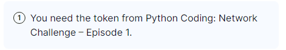
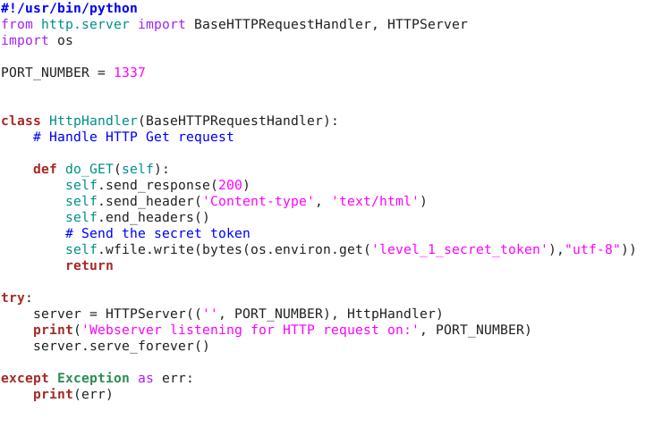
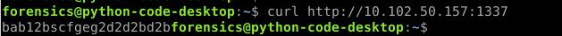
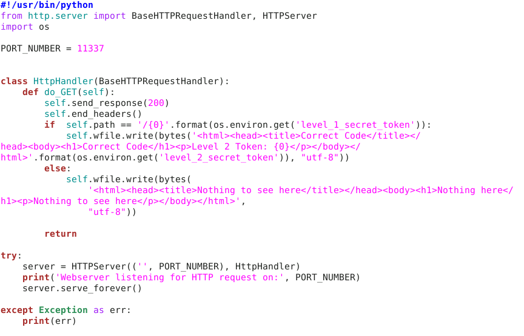
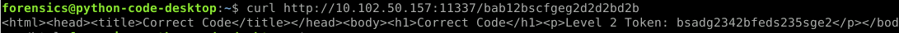
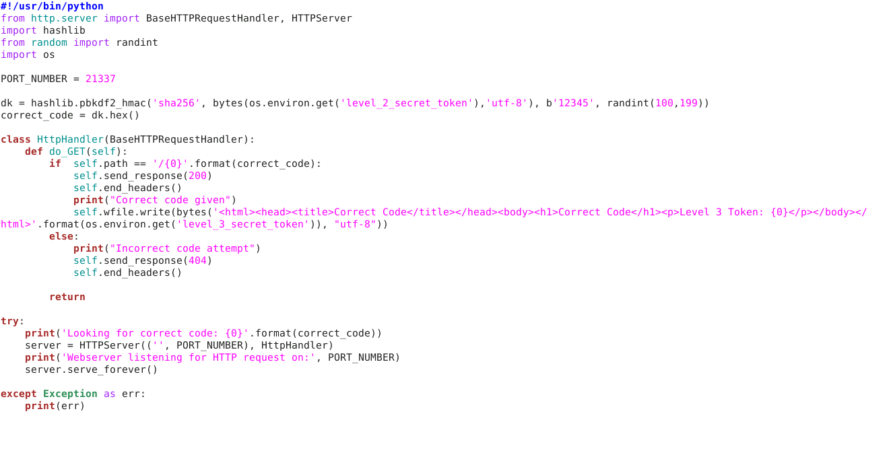
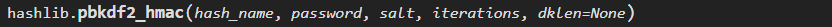
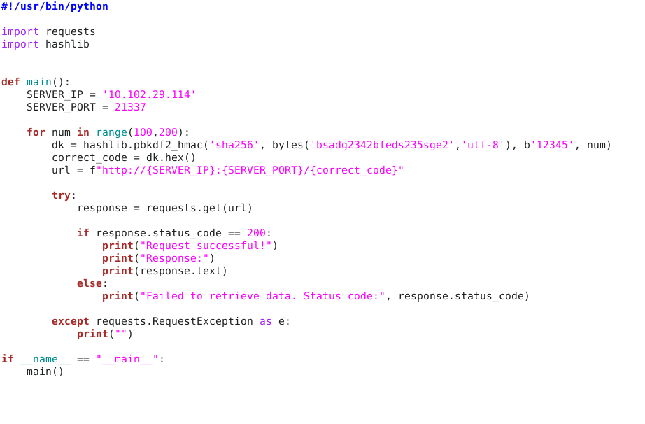
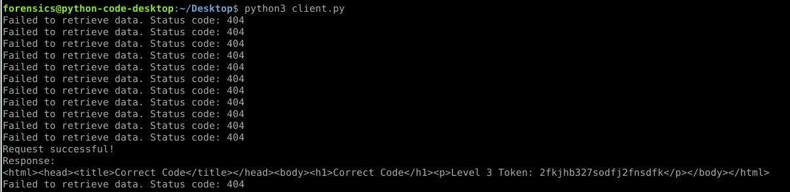

---
---

# IML - Python Coding Network Challenge Ep. 2&3

Can get to it from here:
<https://endeavour.immersivelabs.online/objectives/objective/354d11850f9748feaf33a5e3a2f9b3a1/labs>

As you don't seem to be able to search for this challenge

Note - It says:



But you can get this token from either Ep.2 or Ep.3

**<u>Ep.1</u>**

- Ep.1 - Source code:


- Ep.1 Token:



**<u>Ep.2</u>**

- Ep.2 Source code:



- Ep.2 Token:



**<u>Ep.3</u>**

- Source code:


- This one is a bit more advance - we need to look at this line:

```python
dk = hashlib.pbkdf2_hmac('sha256', bytes(os.environ.get('level_2_secret_token'),'utf-8'), b'12345', randint(100,199))

```

- If we look at the python hashlib docs - we can see what each part does:



We are particularly interested in the last part - the random number of iterations

- So all we need to do is create a for loop and hash every number between 100 and 199 (inclusive):



- Token:


