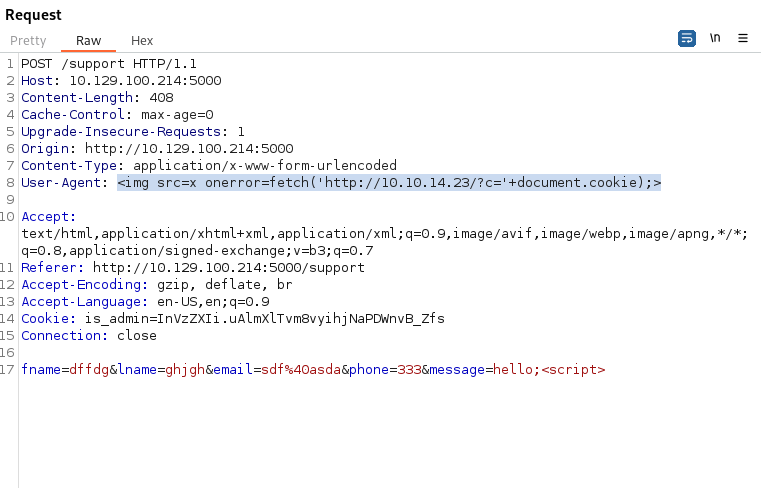

---
---

# HTB - Headless

NMAP


 
Go to port 5000 in a browser - we can see it uses cookies:


- HttpOnly is set to **false**
Which means we can steal the cookies of other users

- Look for directories:

`dirsearch -u http://10.129.35.58:5000 /usr/share/wordlists/seclists/Discovery/Web-Content/raft-large-directories-lowercase.txt`


- On the /support page:


- If we try and enter XSS code, we get this:


- Now looking at the error message, we see that our **User-Agent** information is being reflected

- Open Burp and forward to Repeater

- In order to get Reflected XSS we need to inject the XSS into the User-Agent field and get the page to error like before

- We need to set up a python server to catch the GET request which should have an (admin) cookie attached to it

- Using the payload:

```java


```
and entering **hello;\<script\>** in the **message field** so that it errors. (Anything inside \<\> tags makes this page error)





- Got the cookie:  
is_admin= **ImFkbWluIg.dmzDkZNEm6CK0oyL1fbM-SnXpH0**

- Good article here:  
<https://systemweakness.com/reflected-xss-user-agent-2868ca1d5116>

- In the browser, Inspect -\> Storage -\> Cookies
- Change the cookie to the admin cookie

- Go to **/dashboard**


- Click on generate report and catch the request in Burp and send to Repeater:


- As we can see, the **date** parameter gets passed to the server as an argument

- We can inject commands into this parameter using **;**


- The reverse shells didn't want to work

- But curl works:


- Create a msfvenom linux .elf file and curl it onto the victim machine
- Run chmod +x on the reverse.elf file
- Set up msfconsole listener
- Run ./reverse.elf

- Got shell:


```bash
cat user.txt

```
Upload public key to the ~/.ssh/authorized_keys and use SSH

```bash
sudo -l

```


- Checking the file /usr/bin/syscheck:


- In dvir home, create the file ./initdb.sh:


```bash
chmod +x initdb.sh
sudo /usr/bin/syscheck

```
- We have root:

