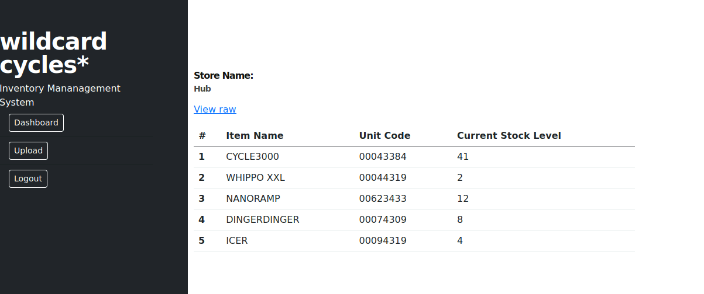

---
---

# IML - XML External Entity Injection




- Copy the contents of the xml


- Create file and paste the xml data in. Then add the:

```bash
<!DOCTYPE store[<!ENTITY signature SYSTEM "file:///tmp/token.txt" >]>
```

to the top

- Make sure the name next to DOCTYPE correlates with the name in the xml script ie. store
- Add the variable \&signature; somewhere in the script


- Upload file and choose from dropdown list


