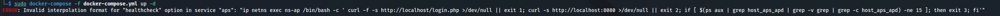
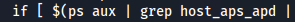
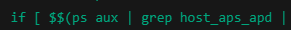

# Docker error - Invalid interpolation format

**<u>Fix:</u>**
You need to escape the \$ characters so Docker doesn't try to treat them as variables.

Replace each \$ with \$\$ in the command field of the healthcheck. That tells Docker to pass a literal \$ to the shell.

