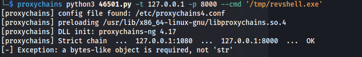

 # Error - Exception: a bytes-like object is required

- Error:


The error a bytes-like object is required, not 'str' occurs when you try to perform an operation that expects a bytes object (binary data), but you provide a str object (text).

This issue is common when working with Python 3, as str and bytes are distinct types.


- Fix:

```python
sock.send("Hello, Server!".encode('utf-8'))  # Convert string to bytes
```
