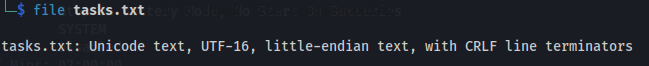
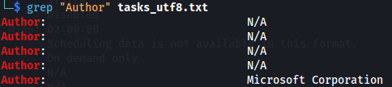

# Grep doesn't give output

When copying a file to KALI from somewhere like Windows, ie. doing:

`schtasks /query /fo LIST /v > tasks.txt`

and then copying it to KALI.

When we check the file:

We can see that it's UTF-16.
Grep is only compatible with simpler files ie. UTF-8

So it needs to get converted first:

`iconv -f UTF-16 -t UTF-8 tasks.txt > tasks_utf8.txt`

Now we can use grep:

