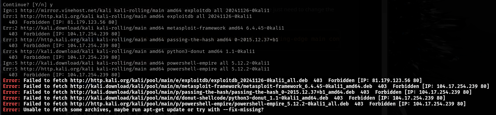

# Kali Apt Update 403 error



**<u>Fix:</u>**

```bash
sudo nano /etc/apt/sources.list
```

Add both lines:

```text
deb-src https://http.kali.org/kali kali-rolling main contrib non-free non-free-firmware
deb-src http://http.kali.org/kali kali-rolling main contrib non-free non-free-firmware
```

```bash
sudo apt update && sudo apt upgrade -y
```
