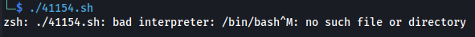

# Linux - Bad interpreter error


**<u>Error:</u>**

zsh: ./41154.sh: bad interpreter: /bin/sh**^M**: no such file or directory



The ^M at the end of /bin/bash^M indicates that your script (41154.sh) has Windows-style line endings (CRLF) instead of Unix-style (LF).
This usually happens when a script is created or edited on Windows and then transferred to a Linux system.

**<u>Fix:</u>**

**Convert the File to Unix Format:**
Run the following command to remove the Windows carriage return (\r):

```bash
sed -i 's/\r$//' 41154.sh
```

or use

**dos2unix if available and convert the file:**

```bash
dos2unix 41154.sh
```
