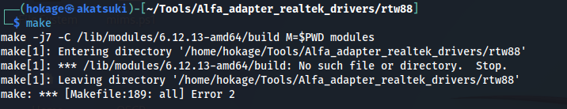

# C - Make error - Missing headers

The error "***No such file or directory: /lib/modules/6.12.13-amd64/build***" means that your system is missing the necessary Linux kernel headers required to compile the driver:


```bash
sudo apt update
sudo apt install linux-headers-$(uname -r) build-essential dkms -y
```