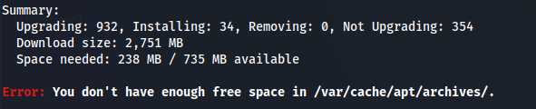

# Linux Error - Apt Update not enough free space

- When trying to do sudo apt upgrade:



**<u>Fix:</u>**

- Move cache to a larger location temporarily
If /var/cache/apt/archives is on a small partition, you can temporarily move it:

```bash
sudo mv /var/cache/apt/archives /tmp/archives
sudo ln -s /tmp/archives /var/cache/apt/archives
```

- Then run apt upgrade again:

```bash
sudo apt update && sudo apt upgrade -y
```

- **After you're done**, restore the original setup:

```bash
sudo rm /var/cache/apt/archives
sudo mv /tmp/archives /var/cache/apt/archives
```
