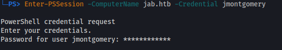

# Linux PWSH WSMan Error

**"Enter-PSSession: This parameter set requires WSMan, and no supported WSMan client library was found. WSMan is either not installed or unavailable for this system."**

```bash
sudo su
git clone https://github.com/jborean93/omi
cd omi
./build.py
```

Choose distro:

```bash
cd build/lib/<distro>
dirname "$( readlink "$( which pwsh )" )"    # /opt/microsoft/powershell/7
cp * /opt/microsoft/powershell/7
```

I also reverted Powershell back to 7.3.8 (but I don't know if that helped or not):



