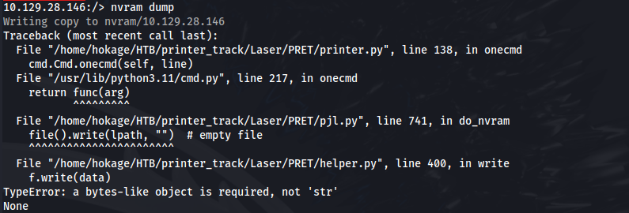
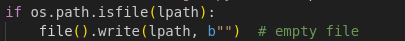
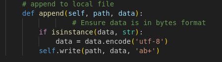
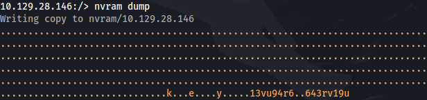

# PRET - Error dumping NVRAM

When running nvram dump:



**<u>Fixes:</u>**

<u>In pjl.py - line 741:</u>

- Change:

```python
file().write(lpath, "") # empty file
```

to

```python
file().write(lpath, b"") # empty file
```



In helper.py - line 406 - append function:

- Change append function to:

```python
def append(self, path, data):
    # Ensure data is in bytes format
    if isinstance(data, str):
        data = data.encode('utf-8')
    self.write(path, data, 'ab+')
```



- Now it works:



