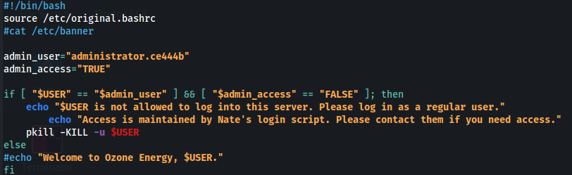

# SCP Connection closed error

**<u>Error 1:</u>**


Fix:
- Find ~/.bashrc or /etc/bash.bashrc
- Remove any command that displays output, ie, echo, cat, etc



**<u>Error 2:</u>**


Fix:
- Add **-O** option into scp:

```bash
scp -O -P 2200 n.reed@10.102.69.197:/tmp/sec.txt .
```

Explained here:

<https://unix.stackexchange.com/questions/709613/ssh-working-on-all-devices-but-scp-from-some-devices-gives-connection-closed-e#:~:text=Quick%20version%20(TL%3BDR)>

TL:DR - Since OpenSSH 8.8 the scp utility uses the SFTP protocol by default. The **-O** option must be used to use the legacy SCP protocol.

And in this case, the target is using OpenSSH 8.2:


