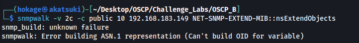
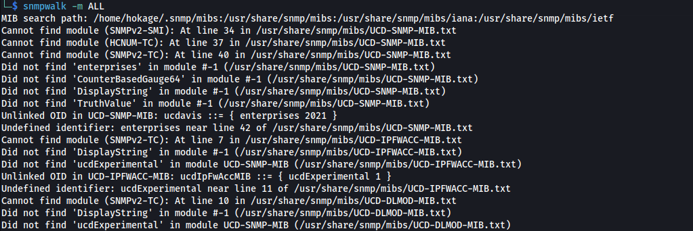
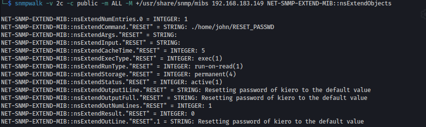

# Snmpwalk error





**<u>Fix:</u>**

```bash
sudo apt update
sudo apt install snmp-mibs-downloader
sudo download-mibs

sudo nano /etc/snmp/snmp.conf
```

Comment out the mibs : line (if present):


```bash
source /etc/snmp/snmp.conf

sudo mv /usr/share/snmp/mibs ~ -rf
git clone https://github.com/librenms/librenms.git
cd librenms
sudo cp mibs /usr/share/snmp/mibs -rf
```



