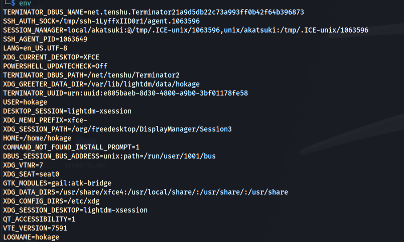

# Fix VirtualBox Kernel Headers Not Found Error

The guest additions CD should be inserted into the VM:

```bash
sudo apt-get install build-essential linux-headers-$(uname -r) dkms
reboot
/sbin/rcvboxadd quicksetup all
```

**<u>OR</u>**

```bash
yum install -y "kernel-devel-uname-r == $(uname -r)"
/sbin/rcvboxadd quicksetup all
reboot
```

Something else - desktop type



